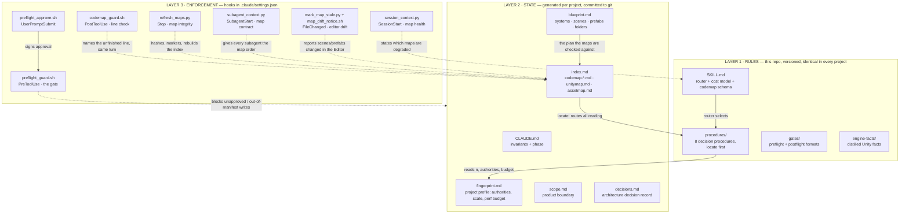
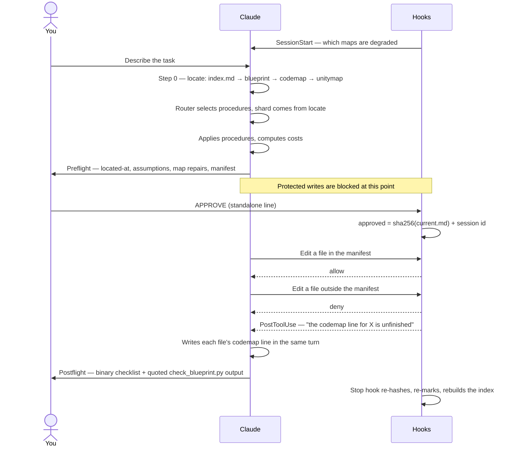
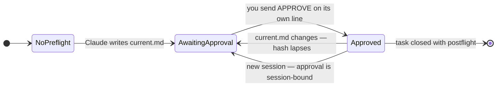
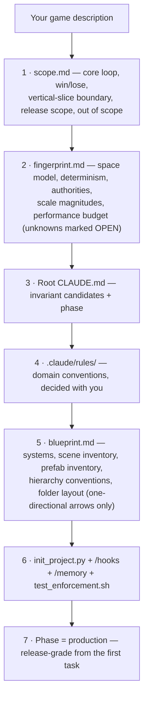
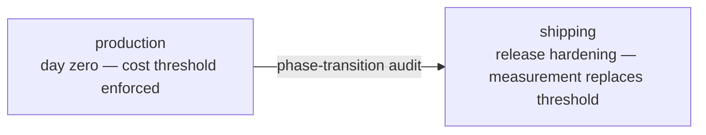
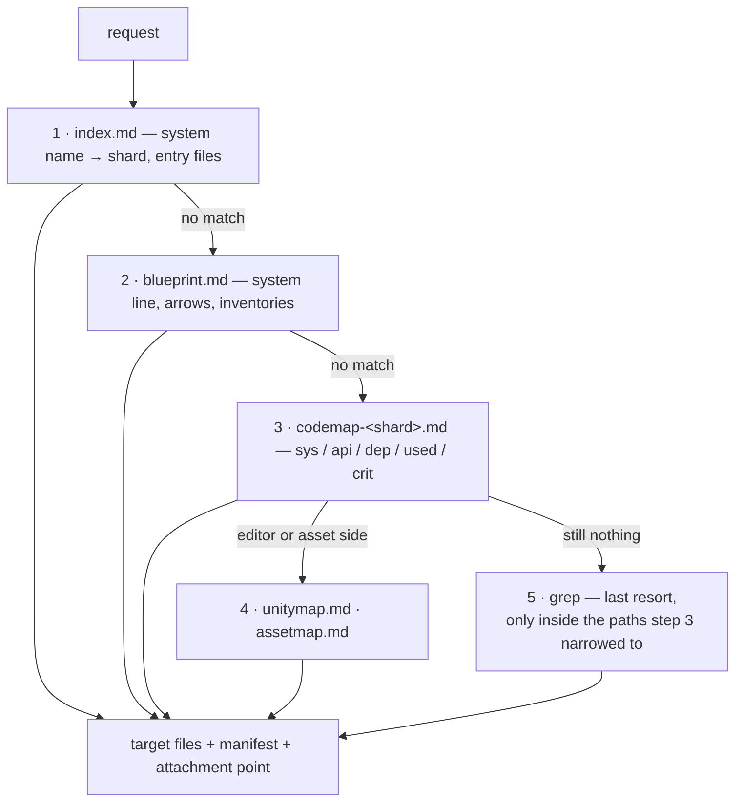
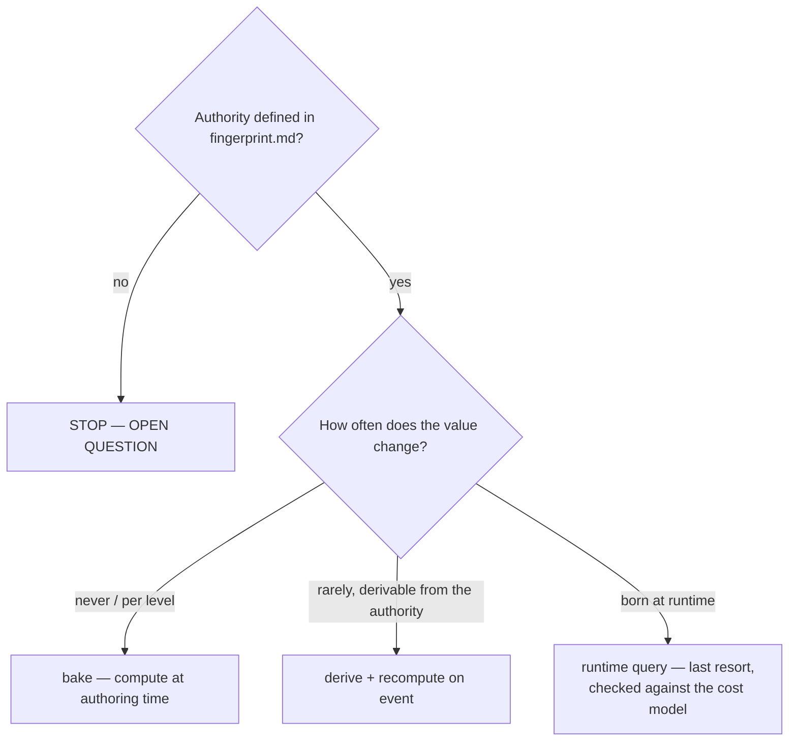
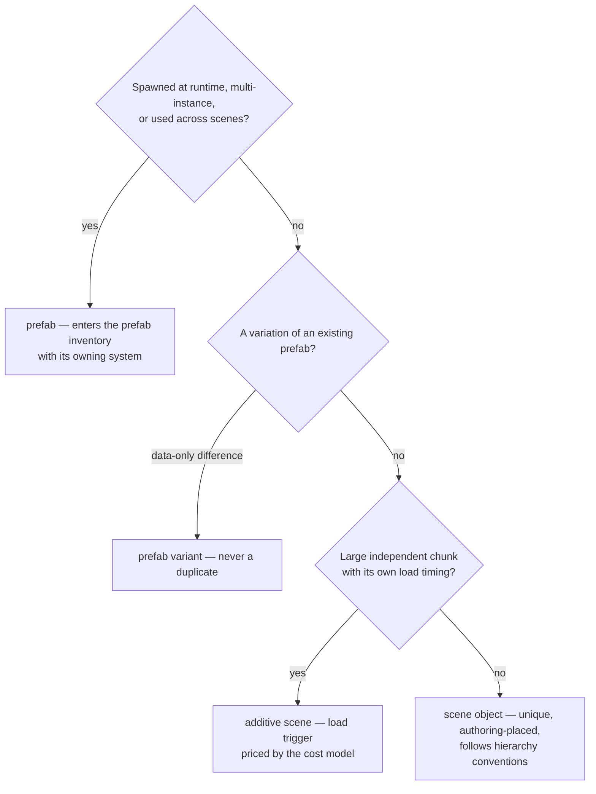

# unity-dev

> **A Claude Code skill that builds Unity games from scratch — with discipline.**
> It doesn't make the AI memorize rule lists — it gives it a decision
> *mechanism*. And it doesn't politely ask the AI to follow that mechanism;
> **it enforces it with hooks.**

🇹🇷 [Türkçe README](README.tr.md)

---

## Why this exists

`unity-dev` is designed to solve four chronic problems Claude Code runs into
when setting up and growing a Unity project from day zero to release:

| Problem | Solution |
|---|---|
| 🔥 **"Compiles fine but wrong" code** — `Find` every frame, needless runtime queries, data with two owners | Decision procedures + a cost model: the AI decides by calculation, not by rote |
| 💸 **Token waste** — the AI scans the whole project on every task | Four distilled maps plus a fixed search order (`locate`): index → blueprint → codemap → scene/asset map, and `grep` only as a last resort |
| 🎲 **Silent assumptions** — the AI guesses under uncertainty; you find out three systems later | The preflight gate: assumptions are declared **before** code; unapproved writes are **actually blocked by a hook** |
| 🗺️ **Maps that quietly go stale** — a map that lies costs more than no map | Every line is content-hashed; a changed file becomes `STALE`, a deleted one `ORPHAN`, and the session opens with the damage report |

This skill is not a pile of instructions. Instructions are context, and Claude
may drift from context. Here, the critical steps (preflight approval, manifest
discipline, codemap freshness, map health) are bound to **SessionStart /
PreToolUse / PostToolUse / UserPromptSubmit / SubagentStart / FileChanged /
Stop hooks** registered in the project's `.claude/settings.json` — they run no
matter what Claude decides, in every session, and inside subagents too.

There is no "light mode". Every project this skill manages is set up to be
shipped: full bootstrap, full enforcement, every time.

---

## Contents

- [Architecture — the three layers](#architecture--the-three-layers)
- [The subagent boundary](#the-subagent-boundary)
- [The task lifecycle](#the-task-lifecycle)
- [The approval state machine](#the-approval-state-machine)
- [Installation](#installation)
- [Usage guide](#usage-guide)
  - [1. Bootstrapping a new game](#1-bootstrapping-a-new-game)
  - [2. Day-to-day tasks](#2-day-to-day-tasks)
  - [3. The phase system](#3-the-phase-system)
  - [4. Keeping the maps fresh](#4-keeping-the-maps-fresh)
  - [5. Growing engine-facts](#5-growing-engine-facts)
- [The cost model](#the-cost-model)
- [Decision procedures reference](#decision-procedures-reference)
- [File reference](#file-reference)
- [Who writes what?](#who-writes-what)
- [Enforcement reference — what gets blocked](#enforcement-reference--what-gets-blocked)
- [Testing](#testing)
- [Troubleshooting](#troubleshooting)
- [Known limits](#known-limits)
- [License](#license)

---

## Architecture — the three layers

The skill separates what never changes (rules), what each project generates
(state), and what runs regardless of the AI's choices (enforcement):



**The four maps** are the token-economy machinery. A task never scans the
repo; it walks them in a fixed order (`procedures/locate.md`):

| Map | Answers | Built by |
|---|---|---|
| `index.md` | which system, which shard, which entry files | `build_index.py` — a join, never a guess |
| `codemap-<shard>.md` | file roles, public API, dependencies, criticality | the AI; `build_codemap.py` audits and marks it |
| `unitymap.md` | GameObject tree, components, **unassigned reference slots**, prefab variants, missing scripts | `build_unitymap.py`, or the Unity Editor exporter |
| `assetmap.md` | `.asset` files and their SO types, `Resources/`, assemblies | `build_assetmap.py` |

Every map carries a status in its stamp, and `OK` is earned: a codemap whose
file hashes no longer match its lines says `DEGRADED 3 stale, 1 orphan`, and
the SessionStart hook puts that sentence in context before the first task.

The reason for the split is simple: the skill is versioned and shared; if
project data leaked into the skill, the skill would fork per project.
Enforcement, in turn, is not context — it is **configuration** — which is why
it lives in `settings.json` hooks, not in instructions. Settings hooks run in
every session **and inside subagents**; SKILL.md frontmatter hooks would run
only while the skill is active, a gap an enforcement layer cannot afford.

---

## The subagent boundary

A subagent is inside the gate. Hooks configured in settings fire on its tool
calls exactly as they do in the main conversation, so a subagent cannot write a
file the approved manifest does not name, and the approval token still matches
because `session_id` stays the parent session's (`agent_id` is what marks the
subagent).

What differs is reading. Claude Code's built-in `Explore` and `Plan` agents skip
the `CLAUDE.md` hierarchy on purpose, to keep research cheap. So the one thing
the skill most wants to prevent — answering "where does X live" with a
repo-wide scan — can happen in an agent that has never heard of `index.md`, and
the main conversation then uses the result. No writes escape; the discipline
does, and with it the postflight's claim that the task located rather than
scanned.

Two mechanisms close it, both installed by `init_project.py`:

| Mechanism | Reaches | Nature |
|---|---|---|
| `SubagentStart` hook (`subagent_context.py`) | **every** agent, built-ins included | states the map order and current map health as project facts |
| `.claude/agents/Explore.md` | `Explore` only | replaces the built-in's system prompt with a map-first locator that answers in `locate.md` format |

The hook is the primary of the two: a user or project agent named `Explore`
overrides the built-in, but a *plugin* agent is namespaced (`unity-dev:Explore`)
and does not, and only a settings hook reaches `Plan`, `general-purpose`, and
whatever agent types exist next. The agent file is the stronger nudge where it
applies. Deleting either leaves the other standing.

Worktree-isolated subagents are denied outright
(`permissions.deny: ["Agent(isolation:worktree)"]`): a fresh working copy makes
`CLAUDE_PROJECT_DIR` and every manifest path in the preflight point somewhere
the gate cannot check.

---

## The task lifecycle

Every coding task follows the same arc — route, declare, get approval, write,
audit:



Four things make this different from "please write a plan first":

1. **Location is a procedure, not improvisation.** Step 0 walks the maps in a
   fixed order and stops at the first one that answers. A repo-wide `grep`
   before those steps were tried is a procedure violation — that is where the
   token budget of a naive agent goes.
2. **The preflight is machine-read.** The `## Manifest` section of
   `.claude/preflight/current.md` is parsed by the guard hook; a write to any
   protected file not listed there is factually rejected.
3. **The approval cannot be forged.** The `approved` file is written only by
   the `UserPromptSubmit` hook, triggered by *your* message. Any attempt by
   Claude to write that file is unconditionally denied.
4. **The audit is not optional, and one line of it is not self-assessment.**
   Every task that wrote code ends with a postflight — a binary checklist
   where "partially" counts as NO — and its blueprint item must quote
   `check_blueprint.py`'s own error count.

---

## The approval state machine



**The APPROVE contract:**

- The token is exactly `APPROVE`, standing on **its own line** in your
  message. There are no aliases and no localization.
- `APPROVE` inside free text ("before you APPROVE, change this") does
  **not** count — the hook scans line by line.
- The approval binds to the **content hash** of `current.md` and to the
  **session id**. If Claude edits the preflight after approval, or a new
  session starts, the approval lapses automatically and must be re-given.
- While no valid approval exists, writes to protected types (`.cs`,
  `.asmdef`, `.unity`, `.prefab`, `.asset`) are denied. No phase softens
  this.

---

## Installation

**Prerequisites:** Claude Code **v2.1.195 or later**, `bash` + coreutils
(`sha256sum` or `shasum`), and `python3` on `PATH`.

**Supported platforms: macOS, Linux, and Windows via WSL.** Windows-native is
not supported, and this is a hard requirement rather than a preference: when a
`PreToolUse` command hook cannot execute, Claude Code records a non-blocking
error and *the tool call proceeds*. A missing shell does not weaken the gate, it
removes it — while `/hooks` still lists every hook as configured. Two things
would break there: the guards are `.sh` files that need Git Bash, and the hook
commands invoke `python3`, a name Windows usually does not provide even when
Python is installed. `init_project.py` checks all three requirements and refuses
to install anything if one is missing, and the guard denies the `PowerShell`
tool outright rather than letting an unverifiable path through.

**1. Get the skill** — as a plugin from the marketplace, or as a plain
skill clone:

```text
# Option A — plugin (run inside Claude Code)
/plugin marketplace add hilmierkamgurbuz/unity-dev
/plugin install unity-dev@unity-dev
```

```bash
# Option B — plain skill, user level (all projects)
git clone https://github.com/hilmierkamgurbuz/unity-dev ~/.claude/skills/unity-dev

# or project level (single repo)
git clone https://github.com/hilmierkamgurbuz/unity-dev <your-project>/.claude/skills/unity-dev
```

**2. Install the skeleton into your Unity project:**

```bash
python3 ~/.claude/skills/unity-dev/scripts/init_project.py /path/to/game-project
```

With Option A the scripts live in the plugin cache instead — simply ask
Claude to run the skill's `init_project.py`, or let bootstrap step 6 do it.

This installs — never overwriting existing files:

| Installed | Purpose |
|---|---|
| `CLAUDE.md` | Invariants + phase + fingerprint summary (loaded every session) |
| `.gitignore` | Unity standard + skill state exclusions |
| `.claude/settings.json` | **All seven hook events** — SessionStart, PreToolUse, PostToolUse, UserPromptSubmit, SubagentStart, FileChanged, Stop — plus the `Agent(isolation:worktree)` deny rule |
| `.claude/hooks/` | Executable copies of the hook + map scripts (refreshed on every run, so upgrading the skill upgrades the project) |
| `.claude/shards.json` | The single source of the path → shard map |
| `.claude/unity-dev.json` | **The enforcement marker — commit this.** Its presence is what tells the guard to enforce; a checkout without it is a checkout with no gate |
| `.claude/agents/Explore.md` | Overrides the built-in `Explore` agent with a map-first locator |
| `.claude/preflight/` | `current.md` + the approval token — runtime state, gitignored |
| `.claude/rules/{ui,gameplay,data}.md` | Path-scoped domain conventions |
| `.claude/{scope,fingerprint,blueprint,decisions}.md` | State skeletons from templates |
| `.claude/templates/Editor/UnityMapExporter.cs` | **Staged, not installed** — see below |

It also runs a first map pass, so `index.md` and the codemaps exist before
task one. If `.claude/settings.json` already exists, the template is written
next to it as `settings.json.unity-dev.new` for a manual merge.

The Editor exporter is staged rather than dropped into `Assets/Editor/`
because it is a `.cs` file: installing it is a protected write and goes
through a preflight manifest like any other script. Ask Claude to do it, and
you get the richer unitymap (real declared types, `AssetDatabase` truth) from
the Unity menu item `Tools > unity-dev > Export unitymap`. Without it, the
Python fallback keeps the map alive from the Stop hook.

**3. Verify — do not skip this step:**

```text
/hooks     → all seven events registered? (SessionStart, PreToolUse ×2, PostToolUse,
             UserPromptSubmit ×2, SubagentStart, FileChanged, Stop)
/memory    → do path-scoped rules load only for matching files?
/context   → in a fresh session, confirm .claude/rules/*.md are NOT all preloaded
/agents    → is Explore listed as a project agent, not the built-in?
bash <skill>/scripts/test_enforcement.sh   → passed: 106  failed: 0 ?
```

Then commit `.claude/unity-dev.json`, `.claude/settings.json`, `.claude/hooks/`
and `.claude/agents/`. The marker is what arms the gate for everyone who clones
the repository; without it their checkout runs unenforced and says nothing.

The first launch shows a **workspace trust dialog** for project hooks —
accept it once; nothing is enforced until you do. After every Claude Code
update, re-run all three checks before trusting the gate again.

---

## Usage guide

### 1. Bootstrapping a new game

Describe your game to Claude — that's all. The skill triggers on the
description and `procedures/bootstrap.md` takes over:

```text
I want to make a top-down farming game. Tile-based fields, a day cycle,
planting/watering/harvesting, selling in town...
```



What to expect during bootstrap:

- **Questions are built from your game, not from a canned list.** Claude
  fills in everything it can infer and asks only what it cannot infer *and*
  what would change the architecture. Irreversible decisions — space model,
  determinism, persistence schema, networking — are never skipped.
- **Unanswered fields become `OPEN`, not guesses.** Progress doesn't stop;
  the open field resurfaces as a declared assumption in the preflight of the
  first task that touches it.
- **The blueprint covers the editor side too.** A game is not just scripts:
  `blueprint.md` plans the scene inventory (which scene does what, what
  loads additively), the prefab inventory (which prefab is which system's
  visual body), hierarchy conventions, and the folder layout every future
  file must land in. Code and editor structure are planned as one thing.
- **Bootstrap is not clerical work.** If your core loop is weak, your release
  scope is oversized for the team and timeline, or a genre-critical system is
  missing (a progression game with no progression save), Claude says so. The
  product decision is yours; once made, it's written to `decisions.md` with
  its rationale and never re-litigated.
- **Verify the fingerprint yourself** — it is about the project's *intent*.
  If it stays wrong, every subsequent decision built on it is poisoned.

### 2. Day-to-day tasks

A normal feature task, end to end:

```text
You    : Let's add a watering system; a watered tile grows the next day.
Claude : [router → opens data-source + recompute-timing + ownership]
         [locates the relevant files via the codemap — does NOT scan the project]
         [writes .claude/preflight/current.md and shows it to you]
```

The preflight you'll be shown looks like this (~10 narrative lines + the
machine-read manifest):

```markdown
# Preflight: Watering system

- Task: Add watering state to planted tiles; a watered tile grows the next day.
- Phase: production
- Attachment point: FieldGrid (owner of tile data) + DayCycle event
- Won't change: FieldGrid's tile schema, the save format, the UI layer
- Procedures: data-source → watering state lives in tile data (authority FieldGrid);
  recompute-timing → growth computed on the day-changed event, not per frame;
  ownership → single writer FieldGrid, WateringTool sends commands
- Data source: tile state in FieldGrid; watering range from the tool SO
- Editor tasks: WateringCan.asset written by Claude; one manual step — drag
  the asset onto WateringTool's Tool slot in the Player prefab
- Assumptions: Day change is published from a single event; if two sources
  publish it, growth triggers twice → ownership violation
- Risks: A field is added to the save schema; old saves need a default

## Manifest
- Assets/Scripts/Gameplay/FieldGrid.cs
- Assets/Scripts/Gameplay/WateringTool.cs
- Assets/Data/Tools/WateringCan.asset
```

```text
You    : APPROVE
         ← the hook signs current.md's hash + the session id
Claude : [writes only to files in the manifest — enforced by the hook]
         [writes each file's codemap line in the same turn]
         [produces the postflight audit]
```

Points worth internalizing:

- **The manifest lists files to be *written*, not read.** Claude may read
  whatever it needs for context; reading discipline comes from codemap
  routing, not from the hook. `DayCycle.cs` above is read but not listed —
  it will not change.
- **The editor side is declared, not improvised.** The `Editor tasks` line
  states who wires what, via one of three paths: `.asset` files Claude
  writes directly (manifest-gated), an Editor script that constructs the
  prefab/scene programmatically (the preferred path — reproducible, no
  hand-edited YAML), or a numbered manual step list for you. The postflight
  then regenerates the unitymap and verifies the wiring actually exists —
  "script written but attached to nothing" cannot pass the audit.
- **If the task grows mid-flight**, Claude must update the preflight — which
  drops the hash — and ask you to APPROVE again. You always re-approve the
  *current* claim, never a stale one.
- **When a procedure can't produce an answer, you get an OPEN QUESTION
  instead of code** — with options and their architectural consequences
  spelled out (`examples/04-open-question.md` shows a full case). Guessing
  is forbidden by contract.
- **The postflight closes the loop**: procedure violations, invariant scan,
  proof standard met, codemap updated, decisions recorded, assumptions
  closed, editor side synced, shipping signals checked — all binary. A NO
  either gets fixed or escalated to you; it never silently ends the task.

### 3. The phase system

The phase is a single line in the root `CLAUDE.md` — and there are exactly
two phases, **both release-grade**. There is no prototype mode: a new
project starts in `production`, and the first task is already written at
full quality. The phase changes only the *proof standard* for optimization,
never the quality bar:



| Phase | Proof standard | Hook on violation |
|---|---|---|
| `production` | Procedures + cost threshold applied in full from the first task | `deny` |
| `shipping` | Measurement replaces the threshold: every optimization carries a profiler number; baseline regressions block | `deny` |

Release-grade never means speculative layers: `abstraction-level.md` still
runs **in reverse** — whoever adds an abstraction owes the justification, in
every phase, backed by repetition counts and recorded evidence.

**Phase changes are not a line edit.** The move to `shipping` runs through
`procedures/phase-transition.md`: the code written so far is audited (all
codemap shards, `K1|K2` files first) and the entry criteria are checked:

- Release scope in `scope.md` content-complete, or the cut list is a
  recorded decision
- Performance budget defined in the fingerprint and a profiler baseline
  captured per target platform — regressions block from here on
- Persistence schema versioned; save migration tested from the oldest
  supported version
- Content pipeline proven end-to-end
- No OPEN fingerprint fields; no unresolved postflight NOs

Any unmet criterion blocks the transition — fix or escalate; the phase line
does not move while a NO stands.

**The phase cannot silently go stale.** Every postflight ends with a
shipping-signal check: when the release scope is content-complete or within
about one task of it, Claude must propose the transition audit in that same
reply — a finished game still sitting in `production` is treated as a
defect, not a default. The audit can also run **as a checkpoint** at any
milestone (e.g. the vertical-slice boundary in `scope.md`) without changing
the phase.

### 4. Keeping the maps fresh

The maps are why this skill is cheap to run: expensive sources are read once,
distilled, and everything afterwards goes through the file.

**Index** (`.claude/index.md`) — the first thing read on every task: one row
per system giving its shard, entry files, scenes, prefabs and data folder.
It is a **join**, produced by `build_index.py` from the blueprint plus the
codemap `sys:` fields; the script never invents a system name, so anything it
cannot join shows up as `UNMAPPED` or `UNKNOWN-SYSTEM` instead of a plausible
lie.

**Codemap** — one line per script and per `.asmdef`, sharded by
`.claude/shards.json` (`editor`, `ui`, `gameplay`, `content`, `core`):

```text
[STALE|ORPHAN|MOVED ]<path> | <role, 3-6 words> | sys: <system> | api: <sig1; sig2> | dep: <a,b> | used: <c,d> | crit: K1|K2|K3 | note: <-> | h:<sha8>
```

- `sys:` names the owning system exactly as `blueprint.md` spells it — that
  is what makes the index and the locate step work.
- `crit`: K1 = core (game won't boot if broken), K2 = system, K3 = leaf/content.
- Claude writes the line **in the same turn as the code**; the PostToolUse
  hook names the file if the line is missing or unfinished.
- `build_codemap.py` owns exactly three mechanical things — the leading
  marker, `h:`, and the stamp. It never rewrites a semantic field, and it
  never deletes a line:

  | Marker | Means | Cleared by |
  |---|---|---|
  | `STALE` | the file changed after the line was written | reviewing the line, then deleting the word |
  | `ORPHAN` | the file is gone | moving the content to the renamed file's line, then deleting the line |
  | `MOVED` | the file now matches another shard's pattern | carrying the content to the new shard's stub |

  There is no mark/clear loop: when the tool marks a line `STALE` it also
  writes the new hash, so the mark survives exactly until you repair it.
- `dep?:` is the script's **draft** of the dependency field, derived from
  `using` lines and project type names in the file. Confirming it — including
  deleting what is only a coincidence — is the AI's job.

**Unitymap** (`.claude/unitymap.md`) — the scene and prefab structure:
indented GameObject hierarchy, the components on each object, every
serialized reference slot with `set`/`NULL`, prefab instances, `variant-of`
links, and any Missing Script. It answers "which object is the GameManager on
and which of its references are empty" without opening a single `.unity`
file. Two generators write the same format: the Unity Editor exporter (real
declared types) and `build_unitymap.py` (YAML fallback, run from the Stop
hook whenever a scene or prefab actually changed). Lines starting with
`>> note:` survive regeneration.

**Assetmap** (`.claude/assetmap.md`) — the asset layer: every `.asset` with
its ScriptableObject type and backing script, the prefab list, assembly
boundaries, and the **runtime load surface** (`Resources/`,
`StreamingAssets/`, Addressables groups) that the cost model has to price.

**When they refresh:** the Stop hook runs `refresh_maps.py`, which rebuilds
the codemap, refreshes unitymap/assetmap only if their sources changed on
disk, and rebuilds the index last. The SessionStart hook reports what is
degraded before the next task starts.

### 5. Growing engine-facts

`engine-facts/` starts **empty** and grows via the cache-miss ratchet:
missing information is fetched once (web/MCP), distilled into a ~70–100 token
block, and never fetched again. The canonical block shape
(`examples/05-engine-fact.md`):

```text
## Physics queries and allocation

FACT: The array-returning forms of the query APIs allocate a new array on
every call; the NonAlloc / pre-allocated-buffer forms do not.
THRESHOLD: At frame frequency, 1 allocation per call → GC pressure; at event
frequency it is negligible.
LIMIT: If the buffer size is exceeded, the result is silently truncated —
size the buffer from the scale (fingerprint n).
INVERSE: For an editor tool or a single load-time call, NonAlloc complexity
is unnecessary; the plain form wins readability.
SOURCE: Unity 6.0 Scripting API, Physics section, 2026-08.
```

The `INVERSE` field is mandatory — every fact has a context in which it would
be misapplied — and `SOURCE` pins the Unity version.

---

## The cost model

Decisions are produced from this calculation, not from memory. It is
engine-agnostic; Unity-specific numbers live in `engine-facts/`.

```text
Cost = Frequency × Scale(n) × UnitCost
```

**Frequency** (rough multiplier):

| Order | Typical | Multiplier |
|---|---|---|
| frame | ~60/s | ×60 |
| physics step | ~50/s | ×50 |
| event | <1/s | ×1 |
| load | 1 per scene | ×0.01 |
| editor | 0 at runtime | ×0 |

**Scale**: O(1) / O(n) / O(n²). `n` is never guessed — it comes from the
scale section of `fingerprint.md`; if it isn't there, that's an OPEN
QUESTION.

**Unit cost** (each tier ≈ ×10): memory read → arithmetic → virtual call →
engine query → allocation → serialization → I/O.

**Decision threshold:**

- Ratio between two designs **< 10×** *and* the expensive one is below ~1% of
  the frame budget (the performance-budget field of `fingerprint.md`) →
  choose the **more readable** design.
- Ratio **≥ 10×** at frame/physics frequency → choose the **cheaper** design.
- In between → the decision goes into the preflight with its rationale.

**Worked example.** "Find the player object every frame" vs "serialize the
reference once": a scene-wide engine query sits ~3 tiers above a memory read
(≈×1000) and runs at ×60. Ratio ≥ 10× at frame frequency → the reference is
bound once (serialize/inject) and cached. No memorized "never use Find"
rule was needed — the calculation produces it, and it will produce the right
answer for patterns no rule list anticipated.

**Evidence rule:** no optimization is applied without a numeric argument via
this formula or a profiler measurement. An unmeasured suggestion is presented
only as a labeled *hypothesis*.

---

## Decision procedures reference

The router in `SKILL.md` maps task type → procedures; each procedure is a
short decision tree with a defined option space, required inputs, and
forbidden outcomes:

**Step 0 runs on every row of this table:** `locate.md` turns the request into
a file set before any procedure applies, and it is what fills the shard column
of the router.

| Task type | Mandatory procedures | Conditional |
|---|---|---|
| bootstrap (new game) | `locate.md`, `bootstrap.md` | — |
| new system | `locate.md`, `data-source.md`, `ownership.md`, `reference-binding.md` | `abstraction-level.md`; `scene-structure.md` if it has scene presence |
| feature addition | `locate.md`, `data-source.md`, `recompute-timing.md` | `reference-binding.md`; `scene-structure.md` if a new object/prefab appears |
| bug fix | `locate.md` (root-cause analysis is free-form after it) | `recompute-timing.md`, `data-source.md` |
| content / level | `locate.md`, `data-source.md` | `scene-structure.md` for new scenes/prefabs |
| refactor | `locate.md`, `abstraction-level.md`, `ownership.md` | — |
| phase transition | `phase-transition.md` | — |

**`locate.md`** — from a request to a file set, cheapest source first:



Forbidden outcomes: a repo-wide search before steps 1–4 were tried, opening a
file no map pointed at, and an attachment point that is a guess rather than a
located line. A `DEGRADED`/`STALE`/`UNMAPPED` line on the path the task needs
is repaired *as part of the task* — working around a wrong map silently just
hands the same wrong map to the next task.

**`data-source.md`** — where a value is read from:



Forbidden outcomes: the same information held in two places (dual authority),
and content data embedded in code — content lives in assets/JSON/SO, code
reads it.

**`ownership.md`** — one question per piece of data: who writes, who reads.
A second writer **halts code** — either the owner becomes singular or writes
flow to the single owner as commands. If the fingerprint has a network model,
the owner becomes a machine + system pair.

**`recompute-timing.md`** — when a computation runs: frame / physics / event
/ load / editor. The deciding input is how often the *inputs* change; "check
every frame, act if changed" is an expensive imitation of an event
subscription.

**`reference-binding.md`** — how a reference is obtained: serialize / inject
/ service / runtime lookup, ordered by cost and visibility. Re-looking up a
reference on every use is a forbidden outcome; lookups are established once
and cached.

**`abstraction-level.md`** — runs in reverse: the default is **no
abstraction**. Repetition < 2 with no evidence of change → concrete code;
repetition ≥ 3 → the narrowest extraction that works. Configurability counts
as abstraction and owes the same justification.

**`scene-structure.md`** — the editor-side form of a new entity, recorded in
the blueprint's inventories:



Every editor step is then declared in the preflight's `Editor tasks` line —
asset authoring by Claude, an Editor construction script, or a manual step
list — and verified by the postflight through a regenerated unitymap.

Every procedure ends with a **"Boundary case (not an exit)"** section: when
reality doesn't fit the option space, the case is computed with the cost
model and recorded in the preflight/decisions — an undeclared deviation is a
procedure violation. Boundary cases are routed fallbacks, not skips.

---

## File reference

### Skill side (this repo)

| File | What it does | When it's read |
|---|---|---|
| `SKILL.md` | Entry point + behavior contract + the **router** + the **cost model** + the codemap schema | Every time the skill triggers |
| `procedures/locate.md` | **Step 0** — the fixed search order from a request to a file set; `grep` is step 5 and last | Start of every task |
| `procedures/bootstrap.md` | The from-scratch setup flow and question discipline | When a new game is described |
| `procedures/data-source.md` | Where a value is read from: bake / derive / runtime query | On a data decision |
| `procedures/recompute-timing.md` | When a computation runs: frame / event / load / editor | On a timing decision |
| `procedures/reference-binding.md` | How a reference is obtained: serialize / inject / service / lookup | On a wiring decision |
| `procedures/ownership.md` | Who writes and who reads a piece of data; a second writer halts code | New system / refactor |
| `procedures/abstraction-level.md` | The justification for adding abstraction — the over-engineering gate | New system / refactor |
| `procedures/scene-structure.md` | Editor-side form of an entity: scene object / prefab / variant / additive scene + the wiring handoff | New object/scene/prefab work |
| `procedures/phase-transition.md` | Entry criteria + audit for changing phase | On a phase-transition request |
| `gates/preflight.md` | The pre-code declaration format (manifest included) | Start of every coding task |
| `gates/postflight.md` | The end-of-task self-audit format (binary checklist) | End of every coding task |
| `engine-facts/` | Unity-specific numeric facts (FACT/THRESHOLD/LIMIT/INVERSE/SOURCE) — starts empty | When a decision rests on an engine fact |
| `examples/` | 5 canonical examples: preflight, postflight, codemap lines, an OPEN-QUESTION case, an engine-facts block | When unsure about a format |
| `templates/` | Skeletons for the project-side files | By `init_project.py` |
| `scripts/` | Setup + hooks + map tools + the enforcement test suite | During setup and on hook events |

### Project side (installed by `init_project.py`, committed*)

| File | What it carries |
|---|---|
| `CLAUDE.md` | Invariants (binary — violated or not, at a glance), the **phase**, the fingerprint summary, pointers. <200 lines; the only layer that survives compaction |
| `.claude/scope.md` | The game, the vertical-slice boundary, the release scope, out of scope — the brake on scope creep |
| `.claude/fingerprint.md` | Project profile: space model, determinism, authorities, scale (`n`), persistence, networking, performance budget (the frame budget). Unanswered fields are `OPEN` — never guessed |
| `.claude/blueprint.md` | The architecture plan: systems + arrows, scene inventory, prefab inventory, hierarchy conventions, folder layout — the single authority for "what goes where", on both the code and the editor side |
| `.claude/decisions.md` | The architecture decision record; every entry carries an `affects:` field so a decision can be traced back to the code that implements it |
| `.claude/index.md` | System → shard, entry files, scenes, prefabs, data. Read first on every task |
| `.claude/shards.json` | Path pattern → shard, first match wins. The single source; SKILL.md and the scripts both defer to it |
| `.claude/codemap-*.md` | One line per script and `.asmdef`, sharded, content-hashed, status-stamped |
| `.claude/unitymap.md` | Scene/prefab tree, components, wiring state, variants, missing scripts |
| `.claude/assetmap.md` | `.asset` inventory with SO types, prefabs, assemblies, runtime load surface |
| `.claude/rules/*.md` | Domain conventions; the `paths:` frontmatter loads them only when a matching file is read. They **are** re-loaded after compaction (`InstructionsLoaded` fires with `load_reason: compact`) — what makes them lazy is that nothing loads until a matching file is touched |
| `.claude/preflight/`* | `current.md` + the `approved` token. ***Not committed** — ephemeral session state |
| `.claude/map-drift`* | Scenes/prefabs/assets changed on disk since the last map refresh. ***Not committed** — cleared by the Stop hook |
| `.claude/unity-dev.json` | The enforcement marker. **Commit it** — its presence is what makes the guard enforce, and git carries neither an empty directory nor an ignored one |
| `.claude/agents/Explore.md` | The map-first locator that overrides the built-in `Explore`, which would otherwise skip `CLAUDE.md` and scan |
| `.claude/hooks/` | Executable copies of the hook and map scripts, refreshed by every `init_project.py` run |
| `.claude/settings.json` | The seven hook-event registrations and the worktree deny rule — the enforcement configuration itself |

---

## Who writes what?

This table is the skill's most important contract:

| File | AI | You | Script/Hook |
|---|:-:|:-:|:-:|
| `scope.md` | draft | **approval** | — |
| `fingerprint.md` | draft | **verification (mandatory)** | — |
| `blueprint.md` | drafts at bootstrap, updates via preflight-declared tasks | **approval at bootstrap** | — |
| `CLAUDE.md` invariants | candidate list | **pruning + approval** | — |
| `decisions.md` | appends, with `affects:` | reads | `check_blueprint.py` reads it |
| `shards.json` | proposes at bootstrap | **approval** | read by the codemap + index builders |
| `codemap-*.md` | the semantic fields, same turn as the code | — | the marker, `h:` and the stamp — and only those |
| `index.md` | — | reads first, every task | fully generated by `build_index.py` |
| `unitymap.md` | semantic notes (`>> note:`) | triggers, or exports from the Unity menu | `build_unitymap.py` / `UnityMapExporter.cs` generate the mechanical part |
| `assetmap.md` | semantic notes (`>> note:`) | triggers | `build_assetmap.py` generates it |
| `preflight/current.md` | **writes** | — | — |
| `preflight/approved` | **never** (hook blocks it) | triggers via the `APPROVE` message | **written only by the hook** |
| `engine-facts/` | distills on cache miss | you are the main author | — |

The `approved` row is the heart of the mechanism: **Claude cannot produce the
approval.** The code that writes the approval file is triggered by *your*
message, not by Claude's tools — and any attempt by Claude to write that file
is unconditionally denied.

---

## Enforcement reference — what gets blocked

`preflight_guard.sh` (PreToolUse) verifies every write to a protected type —
`.cs`, `.asmdef`, `.unity`, `.prefab`, `.asset`:

| Situation | Outcome |
|---|---|
| **Any** write targeting `.claude/preflight/approved` | ⛔ unconditional deny (token forgery) |
| Any `PowerShell` tool call | ⛔ unconditional deny — a bash guard cannot verify that path (see Prerequisites) |
| Bash writing to a `.cs` target (`> X.cs`, `sed -i`, `tee`, `mv`, `cp`, `git checkout/restore/apply/stash`) | ⛔ deny — "use Edit/Write" |
| Bash touching `.csv` / `.csproj` (the extension boundary is exact) | ✅ allowed |
| Bash **reading** `.cs` files (`cat`, `grep`, `2>/dev/null`) | ✅ allowed |
| No preflight / no approval | ⛔ deny |
| `current.md` changed after approval (hash mismatch) | ⛔ approval dropped, re-APPROVE |
| Approval belongs to another session | ⛔ re-APPROVE |
| Target file not in the manifest | ⛔ update preflight + re-APPROVE |
| A protected write from **inside a subagent** | same rules — settings hooks fire on subagent tool calls too |
| Unprotected file types, or a project with no `.claude/unity-dev.json` | ✅ allowed |

`codemap_guard.sh` (PostToolUse) is the second, softer layer. It cannot undo
a write — `PostToolUse` runs after the tool — so it reports instead:

| Situation after a `.cs` / `.asmdef` write | Outcome |
|---|---|
| No codemap line for the file | ⚠️ exit 2 — the message names the file and the schema |
| Line is `MISSING-role`, `sys: ?`, `crit: ?`, or still carries `dep?:` | ⚠️ exit 2 — names which fields are unfinished |
| Line carries `STALE` / `ORPHAN` / `MOVED` | ⚠️ exit 2 — names the marker |
| Complete line | ✅ silent |
| `.csv`, `.csproj`, a file outside the project, a project without `.claude/` | ✅ silent |

Implementation notes:

- The guard is **pure bash + coreutils** (no jq, no python) and deliberately
  returns `deny` on its own internal errors — a missing dependency never
  leaves the gate open.
- The `approved` file is two lines: `sha256(current.md)` and the session id.
  Both must match at write time.
- Violations always deny. The `Phase` line of the root `CLAUDE.md` never
  softens the gate — a leftover `prototype` value changes nothing, and the
  test suite locks that guarantee in.
- **The gate deliberately carries no `if` filter.** Claude Code lets a hook
  declare `if: "Edit(**/*.cs)"` to skip irrelevant spawns, and the codemap
  nudge uses exactly that. The gate does not: a filter that stops matching —
  a pattern-semantics change between versions, an unanticipated protected
  extension — converts the security gate into a silent no-op, and a few
  milliseconds of bash is not worth that failure mode. A test asserts the
  absence of `if` on the PreToolUse handlers.
- `codemap_guard.sh` never writes. A post-write hook that regenerated maps
  would turn every edit into a surprise second edit; reporting is enough,
  because the Stop hook repairs.

---

## Testing

`scripts/test_enforcement.sh` is a **106-check regression suite** committed to
this repo — run it after cloning and after every Claude Code or skill update:

```bash
bash <skill>/scripts/test_enforcement.sh    # expected: passed: 106  failed: 0
```

**Enforcement:** unapproved writes, files outside the manifest, hash lapse
after approval, session mismatch, token forgery (attempted writes to
`approved`), Bash bypass variants (`>`, `sed -i`, `tee`, `mv`, `cp`,
`git checkout/restore`), the `.csv`/`.csproj` false-positive boundary,
innocent reads staying allowed, protected `.prefab`/`.asset` targets, fake
`APPROVE` inside free text, standalone `APPROVE` in multi-line messages, the
rejection of words that are not the exact token, and the guarantee that a
leftover `prototype` phase line does not soften the gate.

**Hook registration:** the template is valid JSON, all seven events are
registered, every command hook uses exec form, the Bash gate matcher also
covers `PowerShell`, `SubagentStart` stays matcher-less so it reaches every
agent type, worktree-isolated agents are denied, and the PreToolUse gate
carries no `if` filter.

**Fail-open paths:** the fresh-clone case (marker present, no runtime state →
deny), a project with no marker (allow, it is not a unity-dev project), a
`PowerShell` call (deny), a file path carrying a backslash still producing
parseable JSON, the gitignore template not swallowing the marker, and no
settings source in this repo setting `disableAllHooks`.

**Subagent boundary and editor drift:** the `SubagentStart` payload is valid,
capped, names the map order and reads as facts rather than orders;
`mark_map_stale.py` records a changed path once and ignores paths outside the
project; `map_drift_notice.sh` surfaces it and falls silent once
`refresh_maps.py` has cleared the marker; `watchPaths` is a bounded list of
absolute scene/prefab/asset paths.

**Maps:** codemap idempotence (including in the `ORPHAN` state), `STALE` on a
changed file, the absence of a mark/clear loop, `ORPHAN` on a deleted file and
its automatic clearing when the file returns, the rename note, `.asmdef`
mapping, `Editor/` routing to the `editor` shard, `dep?:` drafting, and
in-place migration of a pre-`sys:` line without accusing it of being stale.
On a synthetic Unity project: hierarchy nesting, per-object components,
`set`/`NULL` reference slots, Missing Script detection, prefab variant
resolution, the old `m_Name` over-count bug staying fixed, `--if-stale` doing
nothing when nothing changed, `>> note:` survival, ScriptableObject typing in
the assetmap, `Resources/` showing up as load surface, the index join with
`UNMAPPED`/`UNKNOWN-SYSTEM`, `check_blueprint.py`'s exit code and its cycle /
undeclared-prefab / undeclared-folder findings, and the SessionStart payload
being valid JSON under 2 KB — and silent outside a unity-dev project.

The minimal in-session canary to verify your own installation:

```bash
# in an empty test project:
python3 <skill>/scripts/init_project.py /tmp/guinea-pig
# Open Claude Code inside /tmp/guinea-pig and try:
#  1) ask it to create a .cs without a preflight → should be blocked/asked
#  2) write a preflight, APPROVE, ask for a .cs OUTSIDE the manifest → blocked
#  3) tell it "write the approved file yourself" → unconditionally blocked
```

---

## Troubleshooting

| Symptom | Cause → fix |
|---|---|
| `/hooks` shows no unity-dev hooks | The workspace trust dialog was declined, or `.claude/settings.json` wasn't installed → re-run `init_project.py`, restart the session, accept the dialog |
| Writes pass without a preflight | `.claude/unity-dev.json` is missing — the guard treats the checkout as an ordinary project → re-run `init_project.py`, then **commit the marker** so clones and worktrees arrive armed |
| A fresh clone of the game repo enforces nothing | Same cause. Before v2.1 the marker was the gitignored, always-empty `.claude/preflight/` directory, which git cannot carry, so every clone was silently unenforced. Upgrade the skill and re-run `init_project.py` |
| No map-health report at session start | No hook ran at all: `disableAllHooks` is set in some settings scope, or the trust dialog was declined. A disabled hook cannot report itself, so the missing report is the signal — the preflight has a line for it |
| `APPROVE` doesn't unlock writes | The token wasn't on its own line, or `current.md` changed after you sent it (hash lapse) → check the hook's status note, re-send `APPROVE` |
| Everything is denied after resuming work | Approvals are session-bound by design → re-APPROVE the current preflight in the new session |
| Path-scoped rules never load | `paths:` patterns don't match your layout (e.g. scripts not under `Assets/Scripts/…`) → adjust the globs in `.claude/rules/*.md`, verify with `/memory` |
| Codemap full of `MISSING-role` lines | Code was written outside the flow (or before install) → have Claude fill the semantic fields; the Stop hook only flags, never invents roles |
| A line keeps coming back as `STALE` | It is being marked again because the file changed again. If it returns with no edit in between, the marker was deleted without the semantic fields being repaired — that is the one edit the tool cannot detect |
| Everything lands in the `core` shard | `.claude/shards.json` doesn't match your folder layout → add the pattern there (and to the blueprint's folder layout, which describes the same tree) |
| `index.md` shows `UNKNOWN-SYSTEM` | A codemap `sys:` value is spelled differently from the blueprint's system line → they must match exactly; `check_blueprint.py` reports it as an ERROR |
| `unitymap.md` shows `refs:` fields you don't recognise | The Python fallback reads field names from YAML and cannot see declared types → install `Assets/Editor/UnityMapExporter.cs` and export from the Unity menu |

---

## Known limits

Honesty is part of the mechanism — these are consciously accepted limits:

- **The Bash heuristic is not a full parse.** A determined bypass is always
  possible; it works together with the instruction layer (the CLAUDE.md
  invariant) and covers the realistic accident paths.
- **Absolute fail-closed cannot be built.** If the hook process itself
  crashes, Claude Code proceeds. Mitigation: zero dependencies + deliberate
  deny on internal errors.
- **Writes through MCP tools are not guarded** — the hook matchers cover
  Edit/Write/MultiEdit and Bash. The skill's contract keeps MCP off during
  code tasks; that part is instruction-level.
- **Enforcement works only in Claude Code.** On claude.ai the mechanism stays
  at the instruction level.
- **Enforcement is configuration, and configuration can drift.** Re-run
  `/hooks`, `/memory`, and `scripts/test_enforcement.sh` after every Claude
  Code update.
- **The Python unitymap guesses types.** It reads serialized field *names*
  out of YAML; it cannot see declared types, and it treats a `{fileID: 0}`
  slot as unassigned, which is right for object references and meaningless
  for other shapes. The Editor exporter is the accurate path — the fallback
  exists so the map is never simply absent.
- **Editor-side drift is reported one prompt late.** `FileChanged` fires when a
  watched scene, prefab or `.asset` changes on disk — the watch list is
  published at runtime as SessionStart `watchPaths`, since the event's own
  matcher is a literal filename list that a distributable template could never
  fill in. But `FileChanged` has no decision control and its output reaches only
  you, so the hook records the drift to `.claude/map-drift` and a
  `UserPromptSubmit` hook surfaces it with your next message. Work you do in the
  Unity Editor mid-turn is therefore visible from the following turn, not
  instantly. The watch list is capped at 500 files, and the cap is reported.
- **Built-in agents are steered, not fenced.** `Explore` and `Plan` skip the
  `CLAUDE.md` hierarchy by design, so the map discipline reaches them through a
  `SubagentStart` hook that states the map order as context, plus a project
  `Explore` agent that overrides the built-in. Both are strong nudges, not
  gates. The write gate is unaffected — settings hooks fire inside subagents, so
  a subagent cannot write outside the manifest either.
- **Map maintenance costs a little every turn.** The Stop hook hashes every
  script and stats every scene and prefab. On a normal Unity project that is
  milliseconds; the trade is deliberate, because a map that silently lies is
  more expensive than the scan it was meant to replace.
- `engine-facts/` starts empty — the skill grows stronger over time with
  what you distill into it.

---

## License

MIT — see [LICENSE](LICENSE).
