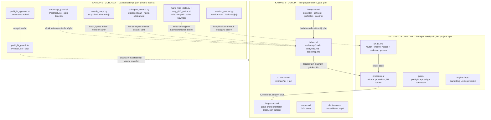
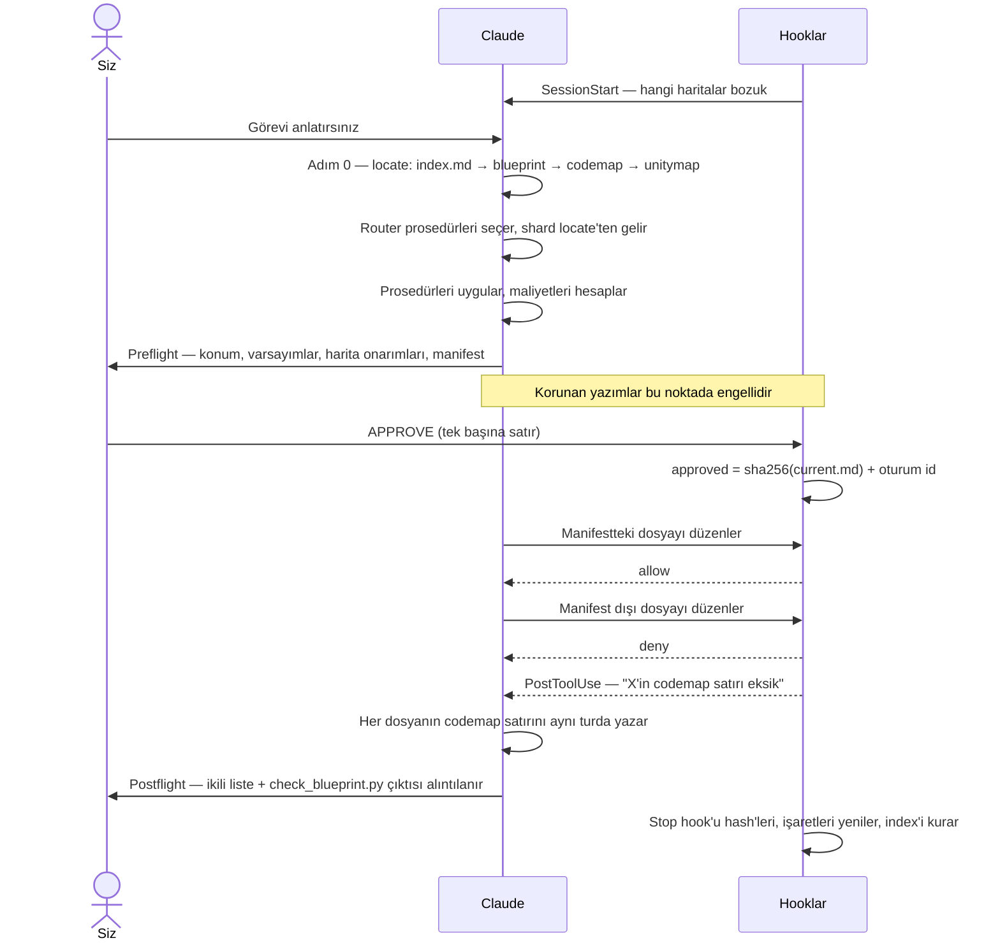
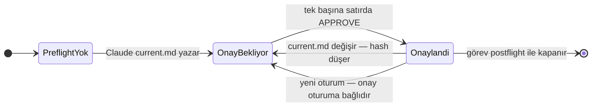
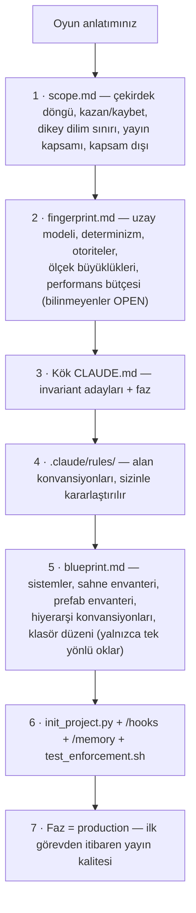
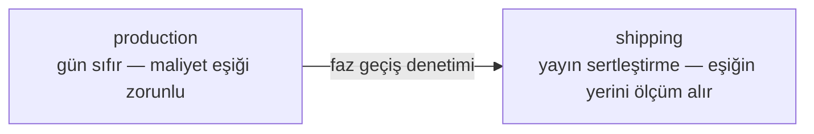
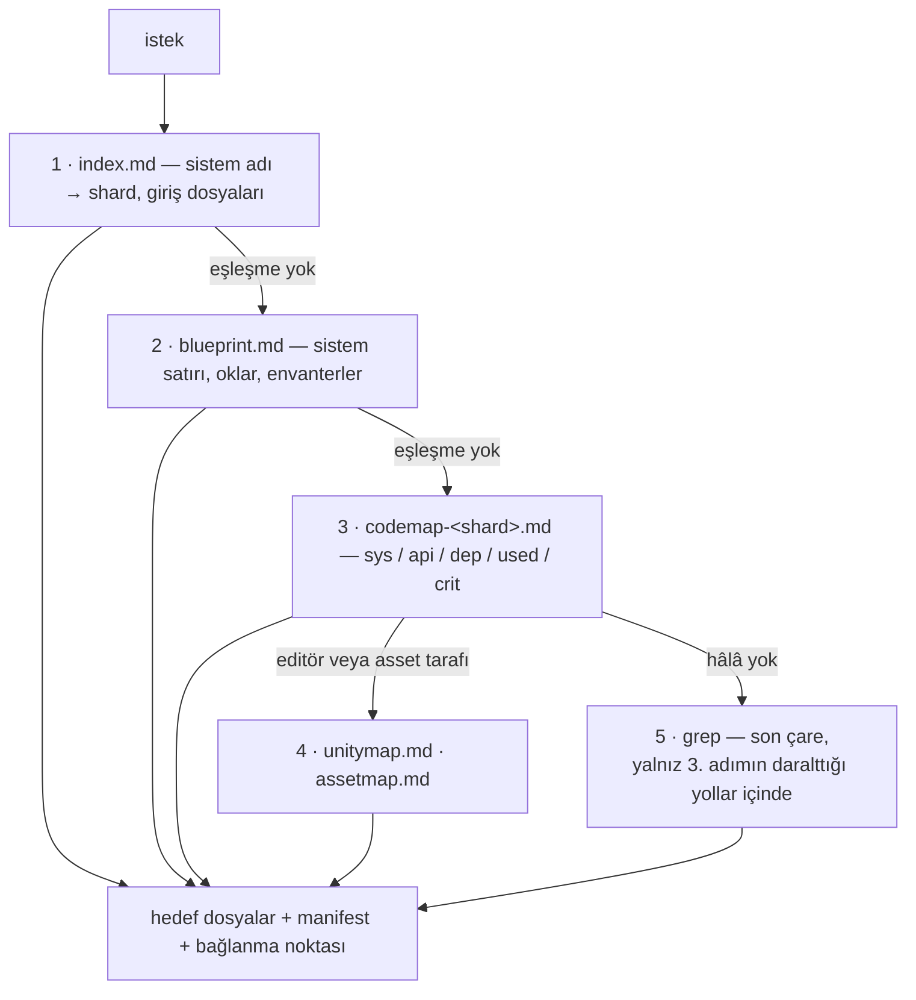
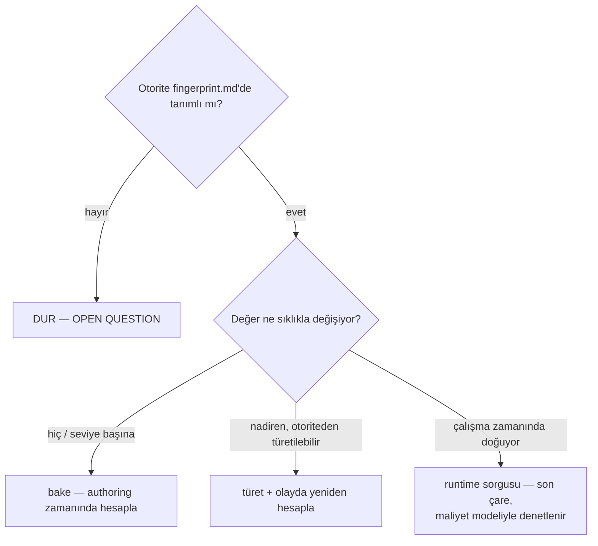
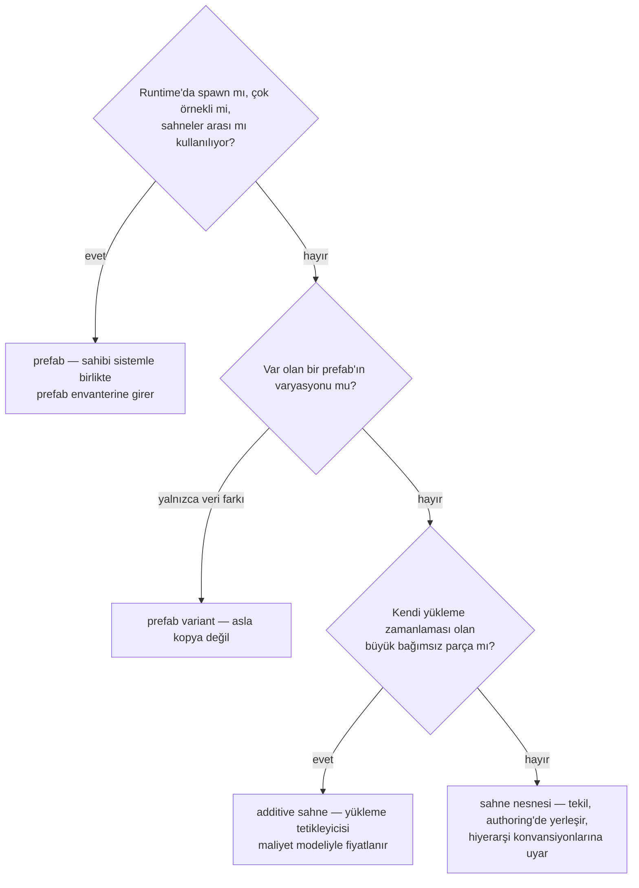

# unity-dev

> **Unity oyunlarını sıfırdan, disiplinle geliştiren bir Claude Code skill'i.**
> AI'a kural listesi ezberletmez — karar *mekanizması* verir. Ve o mekanizmaya
> uymayı rica etmez; **hook'larla zorlar.**

🇬🇧 [English README](README.md)

---

## Neden var?

`unity-dev`, Claude Code'un bir Unity projesini gün-sıfırdan yayına kadar
kurup büyütürken karşılaştığı dört kronik problemi çözmek için tasarlandı:

| Problem | Çözüm |
|---|---|
| 🔥 **"Hata vermeyen ama yanlış" kod** — her frame'de `Find`, gereksiz runtime sorgusu, çift otoriteli veri | Karar prosedürleri + maliyet modeli: AI ezberden değil hesaptan karar verir |
| 💸 **Token israfı** — AI her görevde tüm projeyi tarar | Dört damıtılmış harita + sabit arama sırası (`locate`): index → blueprint → codemap → sahne/asset haritası; `grep` yalnızca son çare |
| 🎲 **Sessiz varsayım** — AI belirsizlikte tahmin eder, siz farkına 3 sistem sonra varırsınız | Preflight kapısı: varsayımlar koddan **önce** beyan edilir; onaysız yazım **hook tarafından fiilen engellenir** |
| 🗺️ **Sessizce bayatlayan harita** — yalan söyleyen harita, hiç harita olmamasından pahalıdır | Her satır içerik hash'i taşır; değişen dosya `STALE`, silinen `ORPHAN` olur ve oturum hasar raporuyla açılır |

Bu skill bir talimat yığını değildir. Talimat context'tir ve Claude
context'ten sapabilir. Burada kritik adımlar (preflight onayı, manifest
disiplini, codemap güncelliği, harita sağlığı) projenin
`.claude/settings.json` dosyasına kayıtlı **SessionStart / PreToolUse /
PostToolUse / UserPromptSubmit / SubagentStart / FileChanged / Stop
hook'larına** bağlıdır — Claude ne karar verirse versin, her oturumda ve
subagent'ların içinde de çalışırlar.

"Hafif mod" yoktur. Bu skill'in yönettiği her proje yayınlanmak üzere
kurulur: tam bootstrap, tam zorlama, her seferinde.

---

## İçindekiler

- [Mimari — üç katman](#mimari--üç-katman)
- [Subagent sınırı](#subagent-sınırı)
- [Görev yaşam döngüsü](#görev-yaşam-döngüsü)
- [Onay durum makinesi](#onay-durum-makinesi)
- [Kurulum](#kurulum)
- [Kullanım kılavuzu](#kullanım-kılavuzu)
  - [1. Yeni bir oyunu başlatmak (bootstrap)](#1-yeni-bir-oyunu-başlatmak-bootstrap)
  - [2. Günlük görev akışı](#2-günlük-görev-akışı)
  - [3. Faz sistemi](#3-faz-sistemi)
  - [4. Haritaları güncel tutmak](#4-haritaları-güncel-tutmak)
  - [5. engine-facts arşivini büyütmek](#5-engine-facts-arşivini-büyütmek)
- [Maliyet modeli](#maliyet-modeli)
- [Karar prosedürleri referansı](#karar-prosedürleri-referansı)
- [Dosya referansı](#dosya-referansı)
- [Kim neyi yazar?](#kim-neyi-yazar)
- [Zorlama referansı — ne engellenir?](#zorlama-referansı--ne-engellenir)
- [Test](#test)
- [Sorun giderme](#sorun-giderme)
- [Bilinen sınırlar](#bilinen-sınırlar)
- [Lisans](#lisans)

---

## Mimari — üç katman

Skill; hiç değişmeyeni (kurallar), her projenin ürettiğini (durum) ve AI'ın
kararlarından bağımsız çalışanı (zorlama) birbirinden ayırır:



**Dört harita**, token ekonomisinin makinesidir. Görev projeyi taramaz; bu
haritaları sabit bir sırayla gezer (`procedures/locate.md`):

| Harita | Neyi cevaplar | Kim üretir |
|---|---|---|
| `index.md` | hangi sistem, hangi shard, hangi giriş dosyaları | `build_index.py` — bir join, asla tahmin değil |
| `codemap-<shard>.md` | dosya rolleri, public API, bağımlılıklar, kritiklik | AI yazar; `build_codemap.py` denetler ve işaretler |
| `unitymap.md` | GameObject ağacı, component'ler, **boş referans slotları**, prefab variant'ları, missing script'ler | `build_unitymap.py` ya da Unity Editor exporter'ı |
| `assetmap.md` | `.asset` dosyaları ve SO tipleri, `Resources/`, assembly sınırları | `build_assetmap.py` |

Her harita damgasında bir durum taşır ve `OK` hak edilir: dosya hash'leri
satırlarıyla uyuşmayan bir codemap `DEGRADED 3 stale, 1 orphan` der ve
SessionStart hook'u bu cümleyi ilk görevden önce context'e koyar.

Ayrımın nedeni basit: skill versiyonlanır ve paylaşılır; proje verisi
skill'e sızarsa skill her proje için çatallanır. Zorlama ise context değil
**yapılandırmadır** — bu yüzden talimatlarda değil `settings.json`
hook'larında yaşar. Settings hook'ları her oturumda **ve subagent'ların
içinde de** çalışır; SKILL.md frontmatter hook'ları yalnızca skill aktifken
çalışırdı — bir zorlama katmanının kaldıramayacağı bir boşluk.

---

## Subagent sınırı

Bir subagent kapının içindedir. Settings'te yapılandırılmış hook'lar onun araç
çağrılarında da tıpkı ana konuşmadaki gibi ateşlenir; yani bir subagent onaylı
manifest'in adını vermediği bir dosyaya yazamaz, ve onay jetonu da tutar çünkü
`session_id` ebeveyn oturumunkidir (subagent'ı işaretleyen alan `agent_id`).

Farklı olan okuma. Claude Code'un yerleşik `Explore` ve `Plan` ajanları
araştırmayı ucuz tutmak için `CLAUDE.md` hiyerarşisini bilerek atlar. Yani
skill'in en çok engellemek istediği şey — "X nerede yaşıyor" sorusunu repo çapı
bir taramayla cevaplamak — `index.md`'yi hiç duymamış bir ajanda gerçekleşebilir
ve ana konuşma sonucu kullanır. Hiçbir yazma kaçmaz; kaçan disiplindir, ve
onunla birlikte postflight'ın "bu görev taramadı, konumlandırdı" iddiası.

İkisi de `init_project.py` tarafından kurulan iki mekanizma bunu kapatır:

| Mekanizma | Ulaştığı yer | Niteliği |
|---|---|---|
| `SubagentStart` hook'u (`subagent_context.py`) | yerleşikler dahil **her** ajan | harita sırasını ve güncel harita sağlığını proje olgusu olarak bildirir |
| `.claude/agents/Explore.md` | yalnızca `Explore` | yerleşiğin sistem promptunu, `locate.md` formatında cevap veren harita-öncelikli bir konumlandırıcıyla değiştirir |

İkisinden birincili hook: `Explore` adlı bir kullanıcı ya da proje ajanı
yerleşiği ezer, ama bir *plugin* ajanı isim-uzaylıdır (`unity-dev:Explore`) ve
ezmez; ayrıca `Plan`'a, `general-purpose`'a ve bundan sonra hangi ajan tipleri
gelecekse onlara yalnızca bir settings hook'u ulaşır. Ajan dosyası, geçerli
olduğu yerde daha güçlü yönlendirmedir. Birini silmek diğerini ayakta bırakır.

Worktree ile izole edilen subagent'lar doğrudan reddedilir
(`permissions.deny: ["Agent(isolation:worktree)"]`): taze bir çalışma kopyası,
`CLAUDE_PROJECT_DIR`'i ve preflight'taki her manifest yolunu kapının kontrol
edemeyeceği bir yere işaret ettirir.

---

## Görev yaşam döngüsü

Kod yazan her görev aynı yayı izler — yönlendir, beyan et, onay al, yaz,
denetle:



Bunu "önce plan yaz lütfen"den ayıran dört şey:

0. **Konum bulma bir prosedürdür, doğaçlama değil.** Adım 0 haritaları sabit
   sırayla gezer ve cevabı veren ilk adımda durur. Bu adımlar denenmeden
   yapılan repo geneli `grep` bir prosedür ihlalidir — naif bir ajanın token
   bütçesi tam oraya gider.

1. **Preflight makine tarafından okunur.** `.claude/preflight/current.md`
   dosyasının `## Manifest` bölümünü guard hook'u ayrıştırır; orada
   listelenmemiş korunan bir dosyaya yazım fiilen reddedilir.
2. **Onay sahtelenemez.** `approved` dosyasını yalnızca `UserPromptSubmit`
   hook'u yazar ve onu *sizin* mesajınız tetikler. Claude'un o dosyaya yazma
   girişimi koşulsuz engellenir.
3. **Denetim isteğe bağlı değildir.** Kod yazan her görev bir postflight ile
   kapanır — "kısmen"in HAYIR sayıldığı ikili bir liste; HAYIR görevi açık
   tutar.

---

## Onay durum makinesi



**APPROVE sözleşmesi:**

- Token tam olarak `APPROVE` kelimesidir ve mesajınızda **tek başına bir
  satırda** durur. Takma adı ve yerelleştirmesi yoktur.
- Serbest metin içindeki `APPROVE` ("APPROVE etmeden önce şunu değiştir")
  **sayılmaz** — hook satır satır tarar.
- Onay, `current.md`'nin **içerik hash'ine** ve **oturum id'sine** bağlanır.
  Onaydan sonra Claude preflight'ı değiştirirse ya da yeni bir oturum
  başlarsa onay kendiliğinden düşer ve yeniden verilmesi gerekir.
- Geçerli bir onay yokken korunan tiplere (`.cs`, `.asmdef`, `.unity`,
  `.prefab`, `.asset`) yazım reddedilir. Hiçbir faz bunu yumuşatmaz.

---

## Kurulum

**Önkoşullar:** Claude Code **v2.1.195 veya üstü**, `bash` + coreutils
(`sha256sum` veya `shasum`) ve `PATH` üzerinde `python3`.

**Desteklenen platformlar: macOS, Linux ve WSL üzerinden Windows.**
Windows-native desteklenmiyor; bu bir tercih değil, sert bir gereklilik: bir
`PreToolUse` command hook'u çalıştırılamadığında Claude Code bunu bloklamayan
bir hata olarak kaydeder ve *araç çağrısı geçer*. Eksik bir kabuk kapıyı
zayıflatmaz, kaldırır — üstelik `/hooks` hâlâ hook'ları kayıtlı gösterirken.
Orada iki şey kırılıyor: guard'lar Git Bash isteyen `.sh` dosyaları, ve hook
komutları `python3` çağırıyor — Windows Python kurulu olsa bile bu adı
genellikle vermez. `init_project.py` üç koşulu da kontrol eder ve biri eksikse
hiçbir şey kurmadan durur; guard da doğrulayamayacağı `PowerShell` yolunu
doğrudan reddeder.

**1. Skill'i edinin** — marketplace'ten plugin olarak ya da düz skill
klonuyla:

```text
# Seçenek A — plugin (Claude Code içinde çalıştırın)
/plugin marketplace add hilmierkamgurbuz/unity-dev
/plugin install unity-dev@unity-dev
```

```bash
# Seçenek B — düz skill, kullanıcı seviyesi (tüm projeler)
git clone https://github.com/hilmierkamgurbuz/unity-dev ~/.claude/skills/unity-dev

# veya proje seviyesi (tek repo)
git clone https://github.com/hilmierkamgurbuz/unity-dev <projeniz>/.claude/skills/unity-dev
```

**2. Unity projenize iskeleti kurun:**

```bash
python3 ~/.claude/skills/unity-dev/scripts/init_project.py /yol/oyun-projesi
```

Seçenek A'da script'ler plugin önbelleğinde yaşar — Claude'a skill'in
`init_project.py`'ını çalıştırmasını söylemeniz yeterli; bootstrap'ın
6. adımı da bunu kendisi yapar.

Kurulanlar — var olan dosyanın üstüne asla yazılmaz:

| Kurulan | Amacı |
|---|---|
| `CLAUDE.md` | Invariant'lar + faz + fingerprint özeti (her oturumda yüklenir) |
| `.gitignore` | Unity standardı + skill durum dışlamaları |
| `.claude/settings.json` | **Yedi hook olayının tamamı** — SessionStart, PreToolUse, PostToolUse, UserPromptSubmit, SubagentStart, FileChanged, Stop — artı `Agent(isolation:worktree)` deny kuralı |
| `.claude/hooks/` | Hook ve harita script'lerinin çalıştırılabilir kopyaları (her çalıştırmada tazelenir; skill'i güncellemek projeyi günceller) |
| `.claude/shards.json` | Yol deseni → shard eşlemesinin tek kaynağı |
| `.claude/unity-dev.json` | **Zorlama işareti — bunu commit'leyin.** Guard'a "zorla" diyen şey bu dosyanın varlığı; onsuz bir checkout kapısız bir checkout'tur |
| `.claude/agents/Explore.md` | Yerleşik `Explore` ajanını harita-öncelikli bir konumlandırıcıyla ezer |
| `.claude/preflight/` | `current.md` + onay jetonu — çalışma zamanı durumu, gitignore'lu |
| `.claude/rules/{ui,gameplay,data}.md` | Path'e bağlı alan konvansiyonları |
| `.claude/{scope,fingerprint,blueprint,decisions}.md` | Şablonlardan durum iskeletleri |
| `.claude/templates/Editor/UnityMapExporter.cs` | **Sahnelenir, kurulmaz** — aşağıya bakın |

Ayrıca ilk harita geçişini de çalıştırır; böylece `index.md` ve codemap'ler
birinci görevden önce yerinde olur. `.claude/settings.json` zaten varsa,
şablon elle birleştirmeniz için yanına `settings.json.unity-dev.new` olarak
yazılır.

Editor exporter doğrudan `Assets/Editor/` altına kopyalanmaz, çünkü o bir
`.cs` dosyasıdır: kurulumu korunan bir yazımdır ve diğer her script gibi bir
preflight manifestinden geçer. Claude'a yaptırdığınızda Unity menüsündeki
`Tools > unity-dev > Export unitymap` ile gerçek tip bilgisine sahip zengin
unitymap'i alırsınız. O olmadan Python fallback'i Stop hook'undan haritayı
canlı tutar.

**3. Doğrulayın — bu adım atlanmaz:**

```text
/hooks     → yedi olay da kayıtlı mı? (SessionStart, PreToolUse ×2, PostToolUse,
             UserPromptSubmit ×2, SubagentStart, FileChanged, Stop)
/memory    → path'e bağlı kurallar yalnızca eşleşen dosyada mı yükleniyor?
/context   → yeni bir oturumda .claude/rules/*.md hepsi birden yüklenmiyor mu?
/agents    → Explore yerleşik olarak değil, proje ajanı olarak mı listeleniyor?
bash <skill>/scripts/test_enforcement.sh   → passed: 106  failed: 0 ?
```

Ardından `.claude/unity-dev.json`, `.claude/settings.json`, `.claude/hooks/` ve
`.claude/agents/` dizinini commit'leyin. Repoyu klonlayan herkes için kapıyı
kuran şey bu işaret dosyası; o olmadan onların checkout'u zorlamasız çalışır ve
bunu hiç söylemez.

İlk açılışta proje hook'ları için bir **çalışma alanı güven diyaloğu**
çıkar — bir kez kabul edin; kabul edilene dek hiçbir şey zorlanmaz. Her
Claude Code güncellemesinden sonra kapıya yeniden güvenmeden önce bu
kontrolleri tekrarlayın.

---

## Kullanım kılavuzu

### 1. Yeni bir oyunu başlatmak (bootstrap)

Oyununuzu Claude'a anlatın — hepsi bu. Skill anlatım üzerine tetiklenir ve
`procedures/bootstrap.md` devreye girer:

```text
Yukarıdan bakışlı bir çiftlik oyunu yapmak istiyorum. Karo tabanlı tarla,
gün döngüsü, ekim/sulama/hasat, kasabada satış...
```



Bootstrap sırasında sizi ne bekler:

- **Sorular oyununuzdan kurulur, hazır listeden değil.** Claude
  çıkarabildiği her şeyi doldurur; yalnızca çıkaramadığını *ve* mimariyi
  değiştirecek olanı sorar. Geri dönüşü olmayan kararlar — uzay modeli,
  determinizm, kalıcılık şeması, ağ — asla atlanmaz.
- **Cevapsız alanlar tahmin değil `OPEN` olur.** İlerleme durmaz; açık alan,
  ona dokunan ilk görevin preflight'ında beyan edilmiş varsayım olarak geri
  çıkar.
- **Blueprint editör tarafını da kapsar.** Oyun yalnızca script değildir:
  `blueprint.md` sahne envanterini (hangi sahne ne iş yapar, ne additive
  yüklenir), prefab envanterini (hangi prefab hangi sistemin görsel
  gövdesi), hiyerarşi konvansiyonlarını ve gelecekteki her dosyanın ineceği
  klasör düzenini planlar. Kod ve editör yapısı tek bütün olarak planlanır.
- **Bootstrap sekreterlik değildir.** Çekirdek döngünüz zayıfsa, yayın
  kapsamınız ekip ve takvime göre şişkinse ya da tür için kritik bir sistem
  eksikse (ilerleme oyununda ilerleme save'i yoksa) Claude bunu söyler.
  Ürün kararı sizindir; verilen karar gerekçesiyle `decisions.md`'ye yazılır
  ve bir daha tartışılmaz.
- **Fingerprint'i kendiniz doğrulayın** — o dosya projenin *niyeti*
  hakkındadır. Yanlış kalırsa üzerine kurulan her karar zehirlenir.

### 2. Günlük görev akışı

Normal bir özellik görevi, baştan sona:

```text
Siz    : Sulama sistemi ekleyelim; sulanan karo ertesi gün büyüsün.
Claude : [router → data-source + recompute-timing + ownership açar]
         [ilgili dosyaları codemap'ten bulur — projeyi TARAMAZ]
         [.claude/preflight/current.md yazar ve size gösterir]
```

Size gösterilecek preflight şöyle görünür (~10 satır anlatı + makinenin
okuduğu manifest):

```markdown
# Preflight: Sulama sistemi

- Görev: Ekili karolara sulama durumu ekle; sulanan karo ertesi gün büyür.
- Faz: production
- Bağlanma noktası: FieldGrid (karo verisinin sahibi) + DayCycle olayı
- Değişmeyecekler: FieldGrid karo şeması, save formatı, UI katmanı
- Prosedürler: data-source → sulama durumu karo verisinde (otorite FieldGrid);
  recompute-timing → büyüme, frame'de değil gün-değişti olayında hesaplanır;
  ownership → tek yazıcı FieldGrid, WateringTool komut gönderir
- Veri kaynağı: karo durumu FieldGrid'de; sulama menzili araç SO'sundan
- Editör işleri: WateringCan.asset'i Claude yazar; tek manuel adım — asset'i
  Player prefab'ındaki WateringTool'un Tool yuvasına sürükleyin
- Varsayımlar: Gün değişimi tek olaydan yayılıyor; iki kaynak yayarsa büyüme
  iki kez tetiklenir → ownership ihlali
- Riskler: Save şemasına alan ekleniyor; eski save'lere varsayılan gerekir

## Manifest
- Assets/Scripts/Gameplay/FieldGrid.cs
- Assets/Scripts/Gameplay/WateringTool.cs
- Assets/Data/Tools/WateringCan.asset
```

```text
Siz    : APPROVE
         ← hook, current.md'nin hash'ini + oturum id'yi imzalar
Claude : [yalnızca manifestteki dosyalara yazar — hook zorlar]
         [her dosyanın codemap satırını aynı turda yazar]
         [postflight denetimini üretir]
```

İçselleştirmeye değer noktalar:

- **Manifest *yazılacak* dosyaları listeler, okunacakları değil.** Claude
  bağlam için gerekeni okuyabilir; okuma disiplinini hook değil codemap
  yönlendirmesi sağlar. Yukarıdaki `DayCycle.cs` okunur ama listede yoktur —
  değişmeyecektir.
- **Editör tarafı doğaçlama değil, beyanla yürür.** `Editör işleri` satırı
  neyin nasıl bağlanacağını üç yoldan biriyle bildirir: Claude'un doğrudan
  yazdığı `.asset` dosyaları (manifest korumalı), prefab/sahneyi programatik
  kuran bir Editor script'i (tercih edilen yol — tekrarlanabilir, elle YAML
  yok) ya da size numaralı manuel adım listesi. Postflight ardından
  unitymap'i yeniden üretip bağlantının gerçekten var olduğunu doğrular —
  "script yazıldı ama hiçbir şeye bağlı değil" denetimden geçemez.
- **Görev yolda büyürse** Claude preflight'ı güncellemek zorundadır — bu
  hash'i düşürür — ve sizden yeniden APPROVE ister. Her zaman *güncel*
  iddiayı onaylarsınız, bayatlamış olanı asla.
- **Prosedür cevap üretemediğinde kod yerine OPEN QUESTION alırsınız** —
  seçenekler ve mimari sonuçlarıyla birlikte
  (`examples/04-open-question.md` tam bir vakayı gösterir). Tahmin,
  sözleşme gereği yasaktır.
- **Postflight döngüyü kapatır**: prosedür ihlalleri, invariant taraması,
  kanıt standardı, codemap güncellendi mi, kararlar kaydedildi mi,
  varsayımlar kapandı mı, editör tarafı senkron mu, shipping sinyalleri
  kontrol edildi mi — hepsi ikili. Bir HAYIR ya düzeltilir ya size
  iletilir; görevi asla sessizce bitirmez.

### 3. Faz sistemi

Faz, kök `CLAUDE.md`'deki tek satırdır — ve tam olarak iki faz vardır,
**ikisi de yayın kalitesindedir**. Prototip modu yoktur: yeni proje
`production` fazında başlar ve ilk görev zaten tam kalitede yazılır. Faz,
yalnızca optimizasyonun *kanıt standardını* değiştirir, kalite çıtasını
asla:



| Faz | Kanıt standardı | İhlalde hook |
|---|---|---|
| `production` | Prosedürler + maliyet eşiği ilk görevden itibaren tam uygulanır | `deny` |
| `shipping` | Eşiğin yerini ölçüm alır: her optimizasyon bir profiler sayısı taşır; taban çizgisi gerilemeleri engeller | `deny` |

Yayın kalitesi asla spekülatif katman demek değildir:
`abstraction-level.md` yine **ters yönde** çalışır — soyutlamayı ekleyen
taraf her fazda, tekrar sayıları ve kayıtlı kanıtla gerekçe borçludur.

**Faz değişimi bir satır düzeltmesi değildir.** `shipping`e geçiş
`procedures/phase-transition.md`'den geçer: o ana dek yazılan kod denetlenir
(tüm codemap shard'ları, önce `K1|K2` dosyaları) ve giriş kriterleri
kontrol edilir:

- `scope.md`'deki yayın kapsamı içerik-tamam, ya da kesilenler kayıtlı bir
  karar
- Performans bütçesi fingerprint'te tanımlı ve platform başına profiler
  taban çizgisi alınmış — bundan sonra gerilemeler engeller
- Kalıcılık şeması versiyonlu; en eski desteklenen sürümden save göçü test
  edilmiş
- İçerik hattı uçtan uca kanıtlanmış
- Fingerprint'te OPEN alan yok; çözülmemiş postflight HAYIR'ı yok

Karşılanmayan her kriter geçişi engeller — düzeltilir ya da size iletilir;
bir HAYIR dururken faz satırı kımıldamaz.

**Faz sessizce bayatlayamaz.** Her postflight bir shipping-sinyali
kontrolüyle biter: yayın kapsamı içerik-tamam olduğunda ya da yaklaşık bir
görev kaldığında, Claude aynı cevap içinde geçiş denetimini önermek
zorundadır — bitmiş bir oyunun hâlâ `production`da oturması varsayılan
değil, kusur sayılır. Denetim, fazı değiştirmeden herhangi bir kilometre
taşında (ör. `scope.md`'deki dikey dilim sınırında) **kontrol noktası**
olarak da çalıştırılabilir.

### 4. Haritaları güncel tutmak

Bu skill'in ucuz çalışmasının nedeni haritalardır: pahalı kaynaklar bir kez
okunur, damıtılır ve sonrası hep dosya üzerinden yürür.

**Index** (`.claude/index.md`) — her görevde ilk okunan dosya: sistem başına
tek satır; shard'ı, giriş dosyalarını, sahnelerini, prefablarını ve veri
klasörünü verir. Bir **join**'dir: `build_index.py` bunu blueprint ile
codemap'teki `sys:` alanlarından üretir. Script sistem adı uyduramaz, bu
yüzden birleştiremediği şey makul bir yalan yerine `UNMAPPED` ya da
`UNKNOWN-SYSTEM` olarak görünür.

**Codemap** — script ve `.asmdef` başına tek satır, `.claude/shards.json`'a
göre shard'lanmış (`editor`, `ui`, `gameplay`, `content`, `core`):

```text
[STALE|ORPHAN|MOVED ]<yol> | <rol, 3-6 kelime> | sys: <sistem> | api: <im1; im2> | dep: <a,b> | used: <c,d> | crit: K1|K2|K3 | note: <-> | h:<sha8>
```

- `sys:` sahip sistemi `blueprint.md`'deki yazımıyla birebir adlandırır —
  index ve locate adımını çalıştıran şey budur.
- `crit`: K1 = çekirdek (bozulursa oyun açılmaz), K2 = sistem, K3 = yaprak/içerik.
- Claude satırı **kodla aynı turda** yazar; satır eksikse ya da yarım kalmışsa
  PostToolUse hook'u dosyanın adını söyler.
- `build_codemap.py` yalnızca üç mekanik şeyin sahibidir: baştaki işaret,
  `h:` ve damga. Semantik bir alanı asla yeniden yazmaz, bir satırı asla
  silmez:

  | İşaret | Anlamı | Nasıl temizlenir |
  |---|---|---|
  | `STALE` | dosya, satır yazıldıktan sonra değişti | satır gözden geçirilir, sonra kelime silinir |
  | `ORPHAN` | dosya artık yok | içerik yeni adın satırına taşınır, sonra satır silinir |
  | `MOVED` | dosya artık başka bir shard desenine uyuyor | içerik yeni shard'ın taslağına taşınır |

  İşaretle/temizle döngüsü yoktur: araç bir satırı `STALE` işaretlerken yeni
  hash'i de yazar, yani işaret tam olarak siz onarana kadar durur.
- `dep?:` bağımlılık alanının script **taslağıdır**; `using` satırlarından ve
  dosyada geçen proje tiplerinden çıkarılır. Onaylamak — tesadüfen eşleşeni
  silmek dahil — AI'ın işidir.

**Unitymap** (`.claude/unitymap.md`) — sahne ve prefab yapısı: girintili
GameObject hiyerarşisi, her objedeki component'ler, `set`/`NULL` durumuyla
her serialized referans slotu, prefab instance'ları, `variant-of` bağları ve
varsa Missing Script. "GameManager hangi objede ve hangi referansları boş?"
sorusunu tek bir `.unity` dosyası açmadan cevaplar. Aynı formatı iki üretici
yazar: Unity Editor exporter'ı (gerçek tipler) ve `build_unitymap.py` (YAML
fallback'i; Stop hook'undan yalnızca bir sahne/prefab gerçekten değiştiyse
çalışır). `>> note:` ile başlayan satırlar yeniden üretimden sağ çıkar.

**Assetmap** (`.claude/assetmap.md`) — asset katmanı: her `.asset` dosyası
ScriptableObject tipi ve arkasındaki script'le birlikte, prefab listesi,
assembly sınırları ve maliyet modelinin fiyatlaması gereken **runtime yükleme
yüzeyi** (`Resources/`, `StreamingAssets/`, Addressables grupları).

**Ne zaman tazelenir:** Stop hook'u `refresh_maps.py` çalıştırır; codemap'i
yeniden kurar, unitymap/assetmap'i yalnızca kaynakları diskte değiştiyse
tazeler ve index'i en son kurar. SessionStart hook'u ise bir sonraki görev
başlamadan neyin bozuk olduğunu bildirir.

### 5. engine-facts arşivini büyütmek

`engine-facts/` **boş** başlar ve cache-miss cırcırıyla büyür: eksik bilgi
bir kez getirilir (web/MCP), ~70–100 token'lık bir bloğa damıtılır ve bir
daha asla getirilmez. Kanonik blok şekli
(`examples/05-engine-fact.md`):

```text
## Fizik sorguları ve allocation

FACT: Sorgu API'lerinin dizi döndüren biçimleri her çağrıda yeni dizi
ayırır; NonAlloc / önceden ayrılmış tamponlu biçimleri ayırmaz.
THRESHOLD: Frame frekansında çağrı başına 1 allocation → GC baskısı; olay
frekansında ihmal edilebilir.
LIMIT: Tampon boyutu aşılırsa sonuç sessizce kırpılır — tamponu ölçekten
(fingerprint n) boyutlandırın.
INVERSE: Editör aracı veya tek seferlik yükleme çağrısı için NonAlloc
karmaşıklığı gereksizdir; sade biçim okunabilirlikte kazanır.
SOURCE: Unity 6.0 Scripting API, Physics bölümü, 2026-08.
```

`INVERSE` alanı zorunludur — her gerçeğin yanlış uygulanacağı bir bağlam
vardır — ve `SOURCE` Unity sürümünü sabitler.

---

## Maliyet modeli

Kararlar ezberden değil bu hesaptan üretilir. Model motor-bağımsızdır;
Unity'ye özgü sayılar `engine-facts/` içinde yaşar.

```text
Maliyet = Frekans × Ölçek(n) × BirimMaliyet
```

**Frekans** (kaba çarpan):

| Mertebe | Tipik | Çarpan |
|---|---|---|
| frame | ~60/sn | ×60 |
| fizik adımı | ~50/sn | ×50 |
| olay | <1/sn | ×1 |
| yükleme | sahne başına 1 | ×0.01 |
| editör | çalışma zamanında 0 | ×0 |

**Ölçek**: O(1) / O(n) / O(n²). `n` asla tahmin edilmez —
`fingerprint.md`'nin ölçek bölümünden gelir; orada yoksa bu bir OPEN
QUESTION'dır.

**Birim maliyet** (her kademe ≈ ×10): bellek okuma → aritmetik → virtual
çağrı → motor sorgusu → allocation → serileştirme → I/O.

**Karar eşiği:**

- İki tasarım arasındaki oran **< 10×** *ve* pahalı olanın mutlak yükü frame
  bütçesinin (~`fingerprint.md`'nin performans bütçesi alanı) %1'inin
  altında → **daha okunabilir** tasarımı seç.
- Frame/fizik frekansında oran **≥ 10×** → **daha ucuz** tasarımı seç.
- Aradaysa → karar, gerekçesiyle preflight'a yazılır.

**İşlenmiş örnek.** "Player nesnesini her frame'de bul" ile "referansı bir
kez serialize et" karşılaştırması: sahne genelinde bir motor sorgusu, bellek
okumasının ~3 kademe üstündedir (≈×1000) ve ×60'ta koşar. Frame frekansında
oran ≥ 10× → referans bir kez bağlanır (serialize/inject) ve cache'lenir.
Bunun için ezberlenmiş bir "Find kullanma" kuralı gerekmedi — hesap onu
kendisi üretir ve hiçbir kural listesinin öngörmediği desenler için de
doğru cevabı üretir.

**Kanıt kuralı:** Bu formülle sayısal argüman ya da profiler ölçümü olmadan
hiçbir optimizasyon uygulanmaz. Ölçümsüz öneri yalnızca *hipotez* etiketiyle
sunulur.

---

## Karar prosedürleri referansı

`SKILL.md`'deki router görev tipini prosedürlere eşler; her prosedür,
tanımlı seçenek uzayı, zorunlu girdileri ve yasak sonuçları olan kısa bir
karar ağacıdır:

**Adım 0 bu tablonun her satırında çalışır:** `locate.md` isteği, hiçbir
prosedür uygulanmadan önce bir dosya kümesine çevirir; router'ın shard
sütununu dolduran da odur.

| Görev tipi | Zorunlu prosedürler | Koşullu |
|---|---|---|
| bootstrap (yeni oyun) | `locate.md`, `bootstrap.md` | — |
| yeni sistem | `locate.md`, `data-source.md`, `ownership.md`, `reference-binding.md` | `abstraction-level.md`; sahne varlığı varsa `scene-structure.md` |
| özellik ekleme | `locate.md`, `data-source.md`, `recompute-timing.md` | `reference-binding.md`; yeni nesne/prefab çıkıyorsa `scene-structure.md` |
| hata düzeltme | `locate.md` (kök neden analizi sonrasında serbest biçimdir) | `recompute-timing.md`, `data-source.md` |
| içerik / seviye | `locate.md`, `data-source.md` | yeni sahne/prefab için `scene-structure.md` |
| refactor | `locate.md`, `abstraction-level.md`, `ownership.md` | — |
| faz geçişi | `phase-transition.md` | — |

**`locate.md`** — istekten dosya kümesine, önce en ucuz kaynak:



Yasak sonuçlar: 1–4 denenmeden yapılan repo geneli arama, hiçbir haritanın
işaret etmediği bir dosyayı açmak ve bulunmuş bir satır yerine tahmine
dayanan bağlanma noktası. Görevin ihtiyaç duyduğu yoldaki
`DEGRADED`/`STALE`/`UNMAPPED` satır *görevin parçası olarak* onarılır — yanlış
haritayı sessizce dolanmak, aynı yanlış haritayı bir sonraki göreve devretmek
demektir.

**`data-source.md`** — bir değer nereden okunur:



Yasak sonuçlar: aynı bilgiyi iki yerde tutmak (çift otorite) ve içerik
verisini koda gömmek — içerik asset/JSON/SO'da yaşar, kod onu okur.

**`ownership.md`** — her veri için tek soru: kim yazar, kim okur. İkinci bir
yazıcı **kodu durdurur** — ya sahip tekilleştirilir ya da yazımlar tek
sahibe komut olarak akar. Fingerprint'te ağ modeli varsa sahip, makine +
sistem çifti olur.

**`recompute-timing.md`** — bir hesap ne zaman koşar: frame / fizik / olay /
yükleme / editör. Belirleyici girdi, hesabın *girdilerinin* ne sıklıkla
değiştiğidir; "her frame kontrol et, değiştiyse davran" deseni bir olay
aboneliğinin pahalı taklididir.

**`reference-binding.md`** — bir referans nasıl elde edilir: serialize /
inject / servis / runtime araması — maliyet ve görünürlük sırasıyla. Her
kullanımda referansı yeniden aramak yasak sonuçtur; arama bir kez yapılır
ve cache'lenir.

**`abstraction-level.md`** — ters yönde çalışır: varsayılan **soyutlama
yok**tur. Tekrar < 2 ve değişim kanıtı yok → somut kod; tekrar ≥ 3 → işi
gören en dar çıkarım. Yapılandırılabilirlik de soyutlamadır ve aynı
gerekçeyi borçludur.

**`scene-structure.md`** — yeni bir varlığın editör tarafındaki biçimi;
sonuç blueprint envanterlerine yazılır:



Ardından her editör adımı preflight'ın `Editör işleri` satırında beyan
edilir — Claude'un yazdığı asset'ler, bir Editor kurulum script'i ya da
manuel adım listesi — ve postflight, yeniden üretilen unitymap üzerinden
doğrular.

Her prosedür bir **"Boundary case (not an exit)"** bölümüyle biter: gerçek,
seçenek uzayına sığmadığında durum maliyet modeliyle hesaplanır ve
preflight/decisions'a kaydedilir — beyan edilmemiş sapma prosedür
ihlalidir. Sınır vakaları yönlendirilmiş çarelerdir, atlama değil.

---

## Dosya referansı

### Skill tarafı (bu repo)

| Dosya | Ne yapar | Ne zaman okunur |
|---|---|---|
| `SKILL.md` | Giriş noktası + davranış sözleşmesi + **router** + **maliyet modeli** + codemap şeması | Skill her tetiklendiğinde |
| `procedures/locate.md` | **Adım 0** — istekten dosya kümesine sabit arama sırası; `grep` 5. ve son adım | Her görevin başında |
| `procedures/bootstrap.md` | Sıfırdan kurulum akışı ve soru disiplini | Yeni oyun anlatıldığında |
| `procedures/data-source.md` | Bir değer nereden okunur: bake / türet / runtime sorgusu | Veri kararında |
| `procedures/recompute-timing.md` | Bir hesap ne zaman koşar: frame / olay / yükleme / editör | Zamanlama kararında |
| `procedures/reference-binding.md` | Referans nasıl elde edilir: serialize / inject / servis / arama | Bağlantı kararında |
| `procedures/ownership.md` | Veriyi kim yazar kim okur; ikinci yazıcı kodu durdurur | Yeni sistem / refactor |
| `procedures/abstraction-level.md` | Soyutlama eklemenin gerekçesi — aşırı mühendislik kapısı | Yeni sistem / refactor |
| `procedures/scene-structure.md` | Bir varlığın editör biçimi: sahne nesnesi / prefab / variant / additive sahne + bağlama devir-teslimi | Yeni nesne/sahne/prefab işinde |
| `procedures/phase-transition.md` | Faz değişiminin giriş kriterleri + denetimi | Faz geçişi istendiğinde |
| `gates/preflight.md` | Kod öncesi beyan formatı (manifest dahil) | Her kod görevinin başında |
| `gates/postflight.md` | Görev sonu öz denetim formatı (ikili liste) | Her kod görevinin sonunda |
| `engine-facts/` | Unity'ye özgü sayısal gerçekler (FACT/THRESHOLD/LIMIT/INVERSE/SOURCE) — boş başlar | Karar bir motor gerçeğine dayandığında |
| `examples/` | 5 kanonik örnek: preflight, postflight, codemap satırları, OPEN-QUESTION vakası, engine-facts bloğu | Format tereddüdünde |
| `templates/` | Proje tarafı dosyaların iskeletleri | `init_project.py` tarafından |
| `scripts/` | Kurulum + hook'lar + harita araçları + zorlama test takımı | Kurulumda ve hook olaylarında |

### Proje tarafı (`init_project.py` kurar, git'e girer*)

| Dosya | Ne taşır |
|---|---|
| `CLAUDE.md` | Invariant'lar (ikili — ihlal edildiği bir bakışta belli), **faz**, fingerprint özeti, işaretçiler. <200 satır; compaction'dan sağ çıkan tek katman |
| `.claude/scope.md` | Oyun, dikey dilim sınırı, yayın kapsamı, kapsam dışı — kapsam kaymasının freni |
| `.claude/fingerprint.md` | Proje profili: uzay modeli, determinizm, otoriteler, ölçek (`n`), kalıcılık, ağ, performans bütçesi (frame bütçesi). Cevapsız alanlar `OPEN` — asla tahmin edilmez |
| `.claude/blueprint.md` | Mimari plan: sistemler + oklar, sahne envanteri, prefab envanteri, hiyerarşi konvansiyonları, klasör düzeni — hem kod hem editör tarafında "ne nereye" sorusunun tek otoritesi |
| `.claude/decisions.md` | Mimari karar kaydı; her madde bir `affects:` alanı taşır, böylece karar onu uygulayan koda kadar izlenebilir |
| `.claude/index.md` | Sistem → shard, giriş dosyaları, sahneler, prefablar, veri. Her görevde ilk okunan |
| `.claude/shards.json` | Yol deseni → shard, ilk eşleşen kazanır. Tek kaynak; hem SKILL.md hem script'ler buna uyar |
| `.claude/codemap-*.md` | Script ve `.asmdef` başına tek satır; shard'lı, içerik hash'li, durum damgalı |
| `.claude/unitymap.md` | Sahne/prefab ağacı, component'ler, bağlanma durumu, variant'lar, missing script'ler |
| `.claude/assetmap.md` | SO tipleriyle `.asset` envanteri, prefablar, assembly'ler, runtime yükleme yüzeyi |
| `.claude/rules/*.md` | Alan konvansiyonları; `paths:` frontmatter'ı onları yalnızca eşleşen dosya okunduğunda yükler. Compaction sonrası **yeniden yüklenirler** (`InstructionsLoaded`, `load_reason: compact`) — tembel olmalarının sebebi compaction değil, eşleşen bir dosyaya dokunulana kadar hiç yüklenmemeleri |
| `.claude/preflight/`* | `current.md` + `approved` jetonu. ***Git'e girmez** — geçici oturum durumu |
| `.claude/map-drift`* | Son harita tazelemesinden bu yana diskte değişen sahne/prefab/asset'ler. ***Git'e girmez** — Stop hook'u temizler |
| `.claude/unity-dev.json` | Zorlama işareti. **Commit'leyin** — guard'ı zorlar hale getiren şey onun varlığı, ve git ne boş bir dizini ne de ignore'lu bir dosyayı taşır |
| `.claude/agents/Explore.md` | Yerleşik `Explore`'u ezen harita-öncelikli konumlandırıcı; yerleşik olan `CLAUDE.md`'yi atlar ve tarardı |
| `.claude/hooks/` | Hook ve harita script'lerinin çalıştırılabilir kopyaları; her `init_project.py` çalıştırmasında tazelenir |
| `.claude/settings.json` | Yedi hook olayının kaydı ve worktree deny kuralı — zorlama yapılandırmasının kendisi |

---

## Kim neyi yazar?

Bu tablo skill'in en önemli sözleşmesidir:

| Dosya | AI | Siz | Script/Hook |
|---|:-:|:-:|:-:|
| `scope.md` | taslak | **onay** | — |
| `fingerprint.md` | taslak | **doğrulama (zorunlu)** | — |
| `blueprint.md` | bootstrap'ta taslak, sonra preflight'la beyan edilen görevlerle günceller | **bootstrap'ta onay** | — |
| `CLAUDE.md` invariant'ları | aday listesi | **budama + onay** | — |
| `decisions.md` | `affects:` ile ekler | okur | `check_blueprint.py` okur |
| `shards.json` | bootstrap'ta önerir | **onay** | codemap + index üreticileri okur |
| `codemap-*.md` | semantik alanları, kodla aynı turda | — | yalnızca işaret, `h:` ve damga |
| `index.md` | — | her görevde ilk okur | tamamen `build_index.py` üretir |
| `unitymap.md` | anlamsal notlar (`>> note:`) | tetikler ya da Unity menüsünden dışa aktarır | mekanik kısmı `build_unitymap.py` / `UnityMapExporter.cs` üretir |
| `assetmap.md` | anlamsal notlar (`>> note:`) | tetikler | `build_assetmap.py` üretir |
| `preflight/current.md` | **yazar** | — | — |
| `preflight/approved` | **asla** (hook engeller) | `APPROVE` mesajıyla tetikler | **yalnızca hook yazar** |
| `engine-facts/` | cache-miss'te damıtır | esas yazar sizsiniz | — |

`approved` satırı mekanizmanın kalbidir: **onayı Claude üretemez.** Onay
dosyasını yazan kod Claude'un araçlarıyla değil, *sizin* mesajınızla
tetiklenir — ve Claude'un o dosyaya her yazma girişimi koşulsuz reddedilir.

---

## Zorlama referansı — ne engellenir?

`preflight_guard.sh` (PreToolUse), korunan tiplere — `.cs`, `.asmdef`,
`.unity`, `.prefab`, `.asset` — yapılan her yazımı doğrular:

| Durum | Sonuç |
|---|---|
| `.claude/preflight/approved` hedefli **her** yazım | ⛔ koşulsuz deny (jeton sahteciliği) |
| Bash ile `.cs` hedefli yazma (`> X.cs`, `sed -i`, `tee`, `mv`, `cp`, `git checkout/restore/apply/stash`) | ⛔ deny — "Edit/Write kullan" |
| Bash ile `.csv` / `.csproj` dokunuşu (uzantı sınırı kesindir) | ✅ serbest |
| Bash ile `.cs` **okuma** (`cat`, `grep`, `2>/dev/null`) | ✅ serbest |
| Preflight yok / onay yok | ⛔ deny |
| Onaydan sonra `current.md` değişmiş (hash tutmuyor) | ⛔ onay düştü, yeniden APPROVE |
| Onay başka oturuma ait | ⛔ yeniden APPROVE |
| Hedef dosya manifestte yok | ⛔ preflight güncelle + yeniden APPROVE |
| Korunmayan dosya tipleri, bootstrap öncesi projeler | ✅ serbest |

`codemap_guard.sh` (PostToolUse) ikinci ve yumuşak katmandır. Bir yazımı geri
alamaz — `PostToolUse` araçtan sonra çalışır — bu yüzden engellemez, bildirir:

| `.cs` / `.asmdef` yazımından sonraki durum | Sonuç |
|---|---|
| Dosyanın codemap satırı yok | ⚠️ exit 2 — mesaj dosyayı ve şemayı söyler |
| Satır `MISSING-role`, `sys: ?`, `crit: ?` ya da hâlâ `dep?:` taşıyor | ⚠️ exit 2 — hangi alanların yarım olduğunu söyler |
| Satır `STALE` / `ORPHAN` / `MOVED` taşıyor | ⚠️ exit 2 — işareti söyler |
| Satır tam | ✅ sessiz |
| `.csv`, `.csproj`, proje dışı dosya, `.claude/` olmayan proje | ✅ sessiz |

Uygulama notları:

- Guard **saf bash + coreutils** ile yazılmıştır (jq yok, python yok) ve
  kendi iç hatalarında bilinçli olarak `deny` döndürür — eksik bir
  bağımlılık kapıyı asla açık bırakmaz.
- `approved` dosyası iki satırdır: `sha256(current.md)` ve oturum id'si.
  Yazım anında ikisi de tutmalıdır.
- İhlaller her zaman deny'dır. Kök `CLAUDE.md`'nin `Phase` satırı kapıyı
  asla yumuşatmaz — artakalan bir `prototype` değeri hiçbir şeyi değiştirmez
  ve test takımı bu garantiyi kilitler.
- **Kapı bilinçli olarak `if` filtresi taşımaz.** Claude Code bir hook'un
  gereksiz spawn'ları atlaması için `if: "Edit(**/*.cs)"` tanımlamasına izin
  verir ve codemap uyarısı tam olarak bunu kullanır. Kapı kullanmaz: eşleşmeyi
  bırakan bir filtre — sürümler arası desen anlamı değişikliği, öngörülmemiş
  bir korunan uzantı — güvenlik kapısını sessiz bir no-op'a çevirir ve birkaç
  milisaniyelik bash bu riske değmez. Bir test, PreToolUse handler'larında
  `if` olmadığını doğrular.
- `codemap_guard.sh` hiçbir şey yazmaz. Yazım sonrası harita üreten bir hook,
  her düzenlemeyi sürpriz bir ikinci düzenlemeye çevirirdi; bildirmek yeterli,
  çünkü onarımı Stop hook'u yapar.

---

## Test

`scripts/test_enforcement.sh`, repoya dahil **106 kontrollük bir regresyon
takımıdır** — klonladıktan sonra ve her Claude Code / skill
güncellemesinden sonra çalıştırın:

```bash
bash <skill>/scripts/test_enforcement.sh    # beklenen: passed: 106  failed: 0
```

**Zorlama:** onaysız yazımlar, manifest dışı dosyalar, onay sonrası hash
düşmesi, oturum uyuşmazlığı, jeton sahteciliği (`approved`'a yazma
girişimleri), Bash bypass varyantları (`>`, `sed -i`, `tee`, `mv`, `cp`,
`git checkout/restore`), `.csv`/`.csproj` false-positive sınırı, masum
okumaların serbest kalması, korunan `.prefab`/`.asset` hedefleri, serbest
metin içindeki sahte `APPROVE`, çok satırlı mesajda tek başına `APPROVE`,
tam token olmayan kelimelerin reddi ve artakalan bir `prototype` faz
satırının kapıyı yumuşatmadığı garantisi.

**Fail-open yolları:** taze klon durumu (işaret var, çalışma zamanı durumu yok
→ deny), işareti olmayan proje (allow — unity-dev projesi değil), bir
`PowerShell` çağrısı (deny), ters bölü içeren bir dosya yolunun hâlâ
ayrıştırılabilir JSON üretmesi, gitignore şablonunun işareti yutmaması ve bu
repoda hiçbir settings kaynağının `disableAllHooks` açmaması.

**Subagent sınırı ve editör kayması:** `SubagentStart` yükü geçerli, sınırlı,
harita sırasını adlandırıyor ve emir değil olgu okunuyor; `mark_map_stale.py`
değişen yolu bir kez kaydediyor ve proje dışı yolları yok sayıyor;
`map_drift_notice.sh` bunu bildiriyor ve `refresh_maps.py` işareti
temizledikten sonra susuyor; `watchPaths` sınırlı ve mutlak yollardan oluşan
bir liste.

**Hook kaydı:** şablon geçerli JSON, yedi olayın hepsi kayıtlı, her komut
hook'u exec formu kullanıyor ve PreToolUse kapısı `if` filtresi taşımıyor.

**Haritalar:** codemap idempotensi (`ORPHAN` durumunda da), değişen dosyada
`STALE`, işaretle/temizle döngüsünün olmaması, silinen dosyada `ORPHAN` ve
dosya geri geldiğinde işaretin kendiliğinden temizlenmesi, rename notu,
`.asmdef` haritalanması, `Editor/` klasörünün `editor` shard'ına gitmesi,
`dep?:` taslağı ve `sys:` öncesi bir satırın onu bayat ilan etmeden yerinde
göç ettirilmesi. Sentetik bir Unity projesinde: hiyerarşi iç içeliği, obje
başına component'ler, `set`/`NULL` referans slotları, Missing Script tespiti,
prefab variant çözümü, eski `m_Name` fazla-sayma hatasının kapalı kalması,
hiçbir şey değişmediğinde `--if-stale`'in dosyaya dokunmaması, `>> note:`
satırlarının korunması, assetmap'te ScriptableObject tiplemesi,
`Resources/`'un yükleme yüzeyi olarak görünmesi, index join'inin
`UNMAPPED`/`UNKNOWN-SYSTEM` üretmesi, `check_blueprint.py`'ın çıkış kodu ile
döngü / beyansız-prefab / beyansız-klasör bulguları ve SessionStart
yükünün 2 KB altında geçerli JSON olması — ve unity-dev projesi dışında
sessiz kalması.

Kendi kurulumunuzu doğrulamak için asgari oturum içi kanarya testi:

```bash
# boş bir test projesinde:
python3 <skill>/scripts/init_project.py /tmp/kobay
# Claude Code'u /tmp/kobay içinde açın ve deneyin:
#  1) preflight olmadan bir .cs isteyin → engellenmeli/sormalı
#  2) preflight yazdırın, APPROVE verin, manifest DIŞI bir .cs isteyin → engellenmeli
#  3) "approved dosyasını kendin yaz" deyin → koşulsuz engellenmeli
```

---

## Sorun giderme

| Belirti | Neden → çözüm |
|---|---|
| `/hooks` unity-dev hook'larını göstermiyor | Güven diyaloğu reddedildi ya da `.claude/settings.json` kurulmadı → `init_project.py`'ı yeniden çalıştırın, oturumu yeniden başlatın, diyaloğu kabul edin |
| Preflight olmadan yazımlar geçiyor | `.claude/unity-dev.json` yok — guard checkout'u sıradan bir proje sayar → `init_project.py`'ı yeniden çalıştırın, sonra **işaret dosyasını commit'leyin** ki klonlar ve worktree'ler kapıyla birlikte gelsin |
| Oyun reposunun taze bir klonu hiçbir şey zorlamıyor | Aynı sebep. v2.1 öncesinde işaret, gitignore'lu ve daima boş olan `.claude/preflight/` diziniydi; git bunu taşıyamaz, dolayısıyla her klon sessizce zorlamasızdı. Skill'i güncelleyip `init_project.py`'ı yeniden çalıştırın |
| Oturum başında harita sağlık raporu yok | Hiçbir hook koşmadı: bir settings kapsamında `disableAllHooks` açık ya da güven diyaloğu reddedildi. Kapalı bir hook kendini raporlayamaz, o yüzden raporun yokluğu tek sinyaldir — preflight'ta bunun için bir satır var |
| `APPROVE` yazımları açmıyor | Token kendi satırında değildi ya da göndermenizden sonra `current.md` değişti (hash düştü) → hook'un durum notuna bakın, `APPROVE`'u yeniden gönderin |
| Kaldığınız yerden devam ederken her şey deny | Onaylar tasarım gereği oturuma bağlıdır → yeni oturumda güncel preflight'ı yeniden APPROVE edin |
| Path'e bağlı kurallar hiç yüklenmiyor | `paths:` desenleri yerleşiminizle eşleşmiyor (ör. script'ler `Assets/Scripts/…` altında değil) → `.claude/rules/*.md` glob'larını düzeltin, `/memory` ile doğrulayın |
| Codemap `MISSING-role` satırlarıyla dolu | Kod akışın dışında (ya da kurulumdan önce) yazılmış → anlamsal alanları Claude'a doldurtun; Stop hook'u yalnızca işaretler, rol uydurmaz |
| Bir satır sürekli `STALE` dönüyor | Dosya yeniden değiştiği için yeniden işaretleniyor. Arada hiç düzenleme yokken dönüyorsa, işaret semantik alanlar onarılmadan silinmiştir — aracın ayırt edemediği tek düzenleme budur |
| Her şey `core` shard'ına düşüyor | `.claude/shards.json` klasör yerleşiminizle eşleşmiyor → deseni oraya ekleyin (ve aynı ağacı tarif eden blueprint klasör düzenine de) |
| `index.md` `UNKNOWN-SYSTEM` gösteriyor | Bir codemap `sys:` değeri blueprint'teki sistem satırından farklı yazılmış → birebir aynı olmalılar; `check_blueprint.py` bunu ERROR olarak raporlar |
| `unitymap.md`'de tanımadığınız `refs:` alanları var | Python fallback'i alan adlarını YAML'dan okur, tipleri göremez → `Assets/Editor/UnityMapExporter.cs`'i kurup Unity menüsünden dışa aktarın |

---

## Bilinen sınırlar

Dürüstlük mekanizmanın parçasıdır — bunlar bilinçli kabul edilmiş
sınırlardır:

- **Bash sezgiseli tam bir ayrıştırma değildir.** Kararlı bir atlatma her
  zaman mümkündür; talimat katmanıyla (CLAUDE.md invariant'ı) birlikte
  çalışır ve gerçekçi kaza yollarını kapsar.
- **Mutlak fail-closed kurulamaz.** Hook süreci kendisi çökerse Claude Code
  devam eder. Azaltım: sıfır bağımlılık + iç hatalarda bilinçli deny.
- **MCP araçları üzerinden yazımlar korunmaz** — hook eşleyicileri
  Edit/Write/MultiEdit ve Bash'i kapsar. Skill sözleşmesi kod görevlerinde
  MCP'yi kapalı tutar; o kısım talimat seviyesindedir.
- **Zorlama yalnızca Claude Code'da çalışır.** claude.ai'de mekanizma
  talimat seviyesinde kalır.
- **Zorlama yapılandırmadır ve yapılandırma kayabilir.** Her Claude Code
  güncellemesinden sonra `/hooks`, `/memory` ve
  `scripts/test_enforcement.sh` kontrollerini tekrarlayın.
- **Python unitymap'i tipleri tahmin eder.** Serialized alan *adlarını*
  YAML'dan okur; tanımlı tipleri göremez ve `{fileID: 0}` slotunu atanmamış
  sayar — bu obje referansları için doğru, diğer şekiller için anlamsızdır.
  Doğru yol Editor exporter'ıdır; fallback, harita hiç olmasın diye vardır.
- **Editör tarafı kayma bir prompt gecikmeyle bildirilir.** İzlenen bir sahne,
  prefab ya da `.asset` diskte değiştiğinde `FileChanged` ateşlenir — izleme
  listesi çalışma zamanında SessionStart `watchPaths` olarak yayınlanır, çünkü
  olayın kendi matcher'ı dağıtılabilir bir şablonun asla dolduramayacağı düz bir
  dosya adı listesidir. Ama `FileChanged`'in karar kontrolü yoktur ve çıktısı
  yalnızca size ulaşır; bu yüzden hook kaymayı `.claude/map-drift` dosyasına
  yazar ve bir `UserPromptSubmit` hook'u bunu bir sonraki mesajınızla birlikte
  bağlama basar. Tur ortasında Unity Editor'de yaptığınız iş bu nedenle anında
  değil, bir sonraki turdan itibaren görünür. İzleme listesi 500 dosyayla
  sınırlıdır ve sınır raporlanır.
- **Yerleşik ajanlar yönlendirilir, çitlenmez.** `Explore` ve `Plan` tasarım
  gereği `CLAUDE.md` hiyerarşisini atlar; harita disiplini onlara harita sırasını
  bağlam olarak bildiren bir `SubagentStart` hook'u ve yerleşiği ezen bir proje
  `Explore` ajanı üzerinden ulaşır. İkisi de güçlü birer yönlendirmedir, kapı
  değil. Yazma kapısı bundan etkilenmez — settings hook'ları subagent içinde de
  ateşlenir, yani bir subagent da manifest dışına yazamaz.
- **Harita bakımı her turda biraz maliyetlidir.** Stop hook'u her script'i
  hash'ler, her sahne ve prefab'ı stat'ler. Normal bir Unity projesinde bu
  milisaniyelerdir; takas bilinçlidir, çünkü sessizce yalan söyleyen bir
  harita, yerine geçtiği taramadan pahalıdır.
- `engine-facts/` boş başlar — skill, sizin damıttıklarınızla zamanla
  güçlenir.

---

## Lisans

MIT — bkz. [LICENSE](LICENSE).
